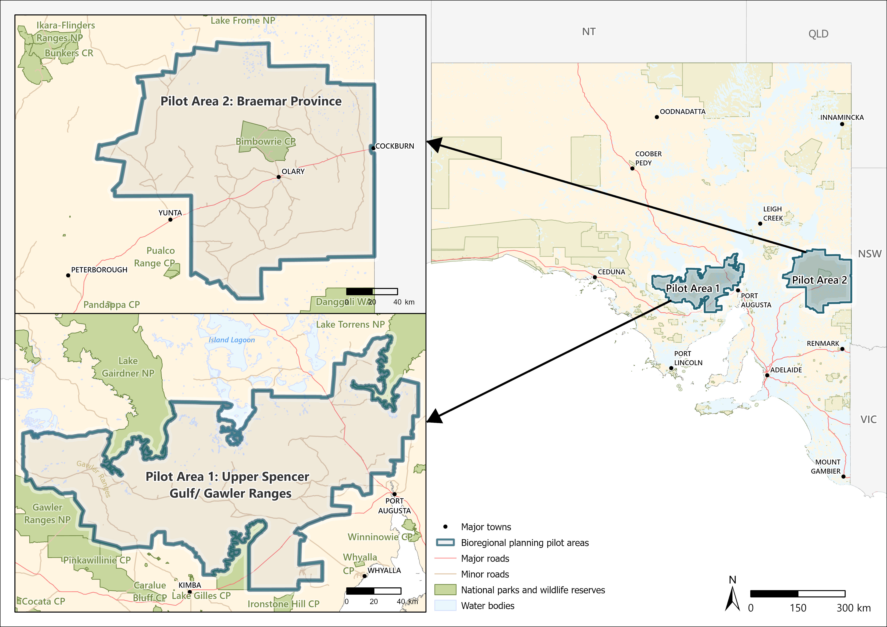

# Introduction

## Background

### Renewable energy transition in South Australia

South Australia is a global leader in the renewable energy transition, having increased the share of net renewable electricity generation from approximately 1% to 74% over just 16 years [@DEW2024]. The state has set ambitious targets, including achieving 100% net renewable electricity generation by 2027 and net zero emissions by 2050, supported by a legislated interim goal of reducing net greenhouse gas emissions by at least 60% by 2030.

This transition is underpinned by abundant wind and solar resources. As of 2021–22, 24 operational wind farms supplied more than 44% of the state’s electricity, while six large-scale solar farms, together with world-leading uptake of rooftop solar (installed on approximately 40% of homes), contributed over 24% [@DEW2024; @DCCEEW2025].

To facilitate further expansion, the state has identified key regions as pilot areas for renewable energy development in the semi-arid zone of South Australia, including the Upper Spencer Gulf (in the Gawler Ranges) and the Braemar region (Fig. \@ref(fig:pilotarea)).

### Ecological impacts of wind and solar energy developments

While renewable energy developments generally have substantially lower environmental impacts than fossil fuel–based energy production [@McCombie2016], poorly sited wind and solar projects can still cause significant ecological threats. In particular, inappropriate siting may lead to habitat loss and degradation in already threatened ecological communities, as well as indirect impacts such as increased human access to previously remote areas [@Bennun2021]. Habitat loss and fragmentation are primarily driven by vegetation clearing and the construction of associated infrastructure, including access roads and transmission lines. These disturbances can also facilitate the spread of invasive species and alter fire regimes by transforming vegetation structure [@Brooks2004; @Wilcox2012]. For example, through the conversion of native woodlands and shrublands into more flammable grass-dominated systems [@Wilcox2012]. In addition to habitat-level impacts, wind and solar facilities can directly affect fauna. Wind turbines pose collision risks to flying species, particularly large soaring birds and bats. Solar panels also attract flying fauna by mimicking water bodies (the “lake effect”), increasing the likelihood of collision with infrastructure [@Bennun2021; @Smallwood2022]. Additional risks associated with certain solar technologies include electrocution, burns from concentrated solar flux, and drowning in evaporation ponds [@Kagan2014; @Jeal2019; @Bennun2021].

### Bioregional planning for renewable energy development

Bioregional planning is a critical strategic initiative designed to facilitate better, faster decision-making by establishing clear conservation priorities and identifying areas where these development can proceed with minimal environmental harm [@West2025]. It is essential for ensuring that the rapid expansion of renewable energy required for net-zero targets does not result in an unacceptable cost to nature, specifically by identifying high-risk areas early to address cumulative impacts that individual project assessments might miss. The framework prioritises siting wind and solar farms on previously modified or degraded landscapes, including agricultural lands, brownfields, and disused industrial sites, while avoiding fragile arid ecosystems and terrain features that concentrate bird or bat movements, such as ridges and important migratory routes. Ultimately, this proactive approach provides greater certainty for stakeholders and developers by streamlining approvals in low-risk areas and fostering outcomes where sustainable energy production and biodiversity restoration can coexist.

*LINK TO THE DESCRIPTIONS OF THESE TWO AOI!!!*

#### Upper Spencer Gulf in Gawler Ranges {-}

#### Braemar Province {-}

The Braemar Province is a major magnetite iron ore region in South Australia, located northeast of Adelaide near the NSW border, containing over 7-8 billion tonnes of defined ore. It is recognized for its potential to produce high-grade iron concentrate for green steel, though development is constrained by limited water and power infrastructure.

```{r pilotarea, echo=FALSE, fig.cap = "Location of the two pilot areas used in the species risk assessment framework: Upper Spencer Gulf/Gawler Ranges (400–500 km northwest of Adelaide) and Braemar Province (300–400 km northeast of Adelaide). Both are situated in the semi-arid zone of South Australia. Map produced by the GIS team, DEW (2025)."}



```
