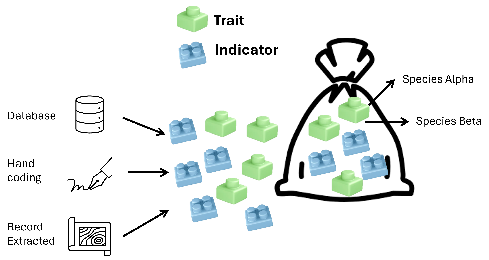
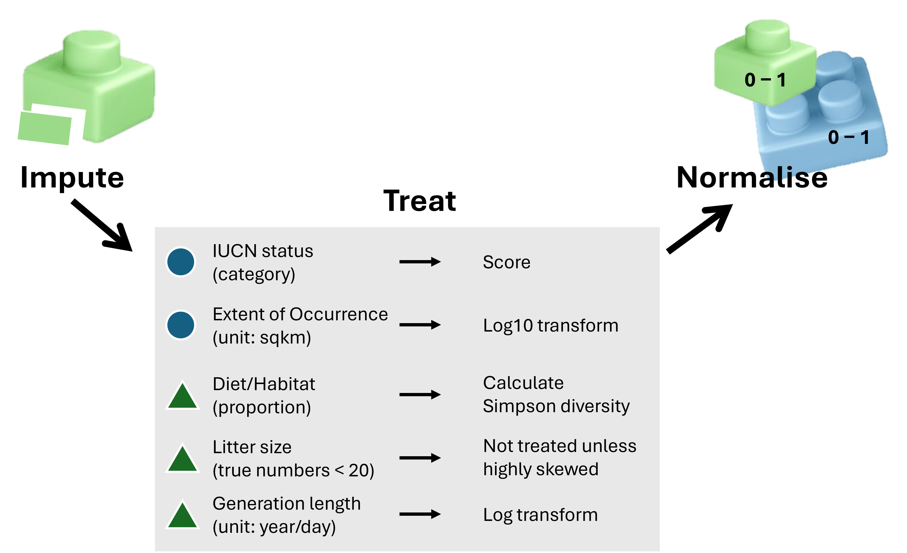
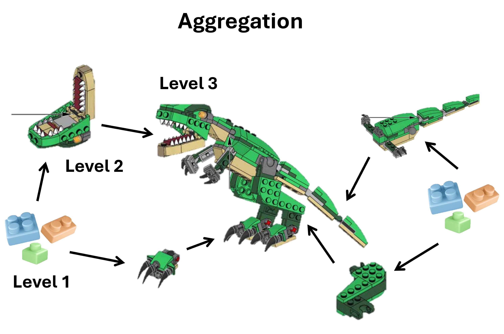
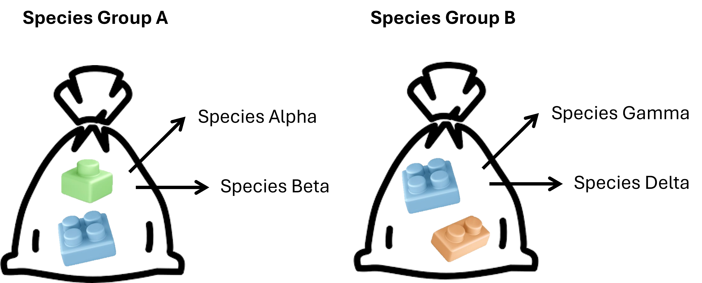

# Methodology - Concept

## The Most Basic Approach

To produce the risk map, species can be conceptualised as competing to represent the level of risk within each pixel. Determining which species represents the higher risk requires the integration of multiple sources of information. These include species traits, which describe biological characteristics that can be generalised at the species level, and indicators, which are analysed or interpreted metrics that inform the status, condition, or overall performance of a species.

Traits and indicators can be thought of as LEGO blocks, where each block has its own properties and role. These components are ultimately combined and stacked together to represent the overall characteristics and risk profile of a species.

Examples of traits: growth form (plant), body mass, diet, habitat, nest type, generation length, litter size

Examples of indicators: taxonomy (is snake, raptors, etc), extent of occurrence, IUCN status, population trend

Many studies have identified traits and indicators that are significantly associated with species risk or sensitivity. For example, [this study](https://www.sciencedirect.com/science/article/abs/pii/S0006320717302720) compiled traits linked to increased predation risk by cats. It then applied a weighted model to these traits to predict cat predation risk across all Australian bird species. Each species was assigned a  a single value of probability that represents its relative risk of killed by cats.

## Dealing With Each Trait/Indicator

There are three main approaches to deriving traits and indicators:

1. Use existing databases, such as static datasets from published sources or dynamic online databases (e.g. IUCN).
   *Pros:* readily accessible.
   *Cons:* difficult to harmonise across different data systems.

2. Extract spatial information from species occurrence or sighting records.
   *Pros:* widely available and often complete in space.
   *Cons:* subject to spatial bias and not suitable for qualitative traits (e.g. diet).

3. Manually code traits based on expert knowledge or defined rules.
   *Pros:* consistent and standardised across species.
   *Cons:* time-consuming and dependent on clear, well-defined criteria.

Trait/indicator data rarely comes in complete and readily usable for every species. **Imputation** is often required to fill the missing data.

```{r fig1, echo=FALSE}

```

## Dealing With Multiple Traits/Indicators

Each trait or indicator is measured on a different scale and unit, ranging from continuous values (e.g. extent of occurrence in km², from 10,000 to 134,000,000), to categorical variables that requires scoring, proportions (e.g. habitat, diet, or climate use), and binary variables (0/1). These variables must therefore be standardised before aggregation into a single composite value. The most basic approach is min–max normalisation, where values are rescaled so that the minimum becomes 0 and the maximum becomes 1.

Using LEGO blocks as an example, this step ensures that individual blocks are compatible and can be stacked together (i.e. studs align with anti-studs).

```{r fig2, echo=FALSE}

```

## Aggregation

Once each trait or indicator has been normalised, they can be combined into a single composite value. This process can be thought of as assembling LEGO blocks: if the individual components (traits/indicators) are simple and few in number, they can be combined directly. However, for more complex LEGO model, it is often more effective to first group related indicators, combine them into intermediate parts, and then aggregate these parts into the final feature.

The process of aggregating a composite indicator follows the same principle. A simple indicator such as cat-killed risk may not require hierarchical grouping, allowing all traits and indicators to be combined directly. However, when more aspects and variables are included, a multi-level grouping structure is necessary.

Values can be aggregated using different methods. The most basic is the arithmetic mean, where values are summed and averaged with equal weight. The geometric mean also calculates an average but penalises unevenness, as high values are less able to compensate for low values. Other more complex methods can also be used depending on the specific purpose.

```{r fig3, echo=FALSE}

```

## Challenges of Comparison

Ideally, universally applicable “LEGO blocks” would be used, but in practice not all components are available or required to build a final feature.

Birds differ functionally from mammals and reptiles due to their ability to fly. Reptiles differ from mammals as ectotherms, while fish and amphibians are generally water-dependent. In trait-based studies, it is therefore often inappropriate to directly compare species across taxonomic classes. However, for policy and risk assessment purposes, such comparisons are still made. For example, [this study](https://esajournals.onlinelibrary.wiley.com/doi/10.1002/ecs2.3919) uses on–off matrices to score sensitivity and exposure across 12 taxonomic classes.

```{r fig4, echo=FALSE}

```