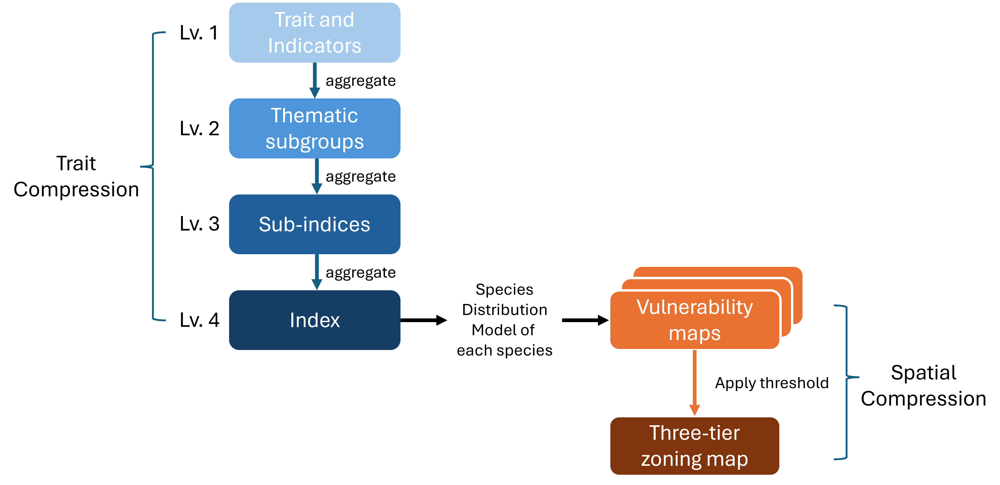

# Methods

## Trait and indicator selection

Species traits (e.g., migratory status, habitat use) and ecological indicators (e.g., extent of occurrence) were used to develop the scoring framework for quantifying species vulnerability. These variables were sourced using three complementary approaches: (1) existing trait databases, (2) extraction from species observation records, and (3) manual coding from published literature and online resources. Combining these approaches allows for broader trait coverage while balancing data availability and quality across species groups.

### Existing databases

Trait information was sourced from established databases where available. The availability and quality of these databases vary across taxonomic groups: birds and freshwater fish are relatively well represented, while plants often have structured trait systems but remain data-deficient for many species. In contrast, mammals, reptiles, and amphibians currently lack comprehensive and well-populated trait databases.

**Advantages:**
Existing databases provide analysis-ready data with standardised coding, often developed and reviewed by experts (e.g., BirdBase or national compilations such as Garnett et al. 2014 for Australian birds). This facilitates efficient integration into modelling workflows.

**Limitations:**
Integrating multiple databases can be challenging due to differences in classification systems, variable definitions, and formats. Missing data are also common and may require imputation, which can introduce additional uncertainty.

### Extraction from observation records

Trait-related indicators were derived from cleaned species occurrence records (prepared as part of the SDM workflow). This approach is particularly useful for estimating spatially explicit characteristics, such as climate breadth or habitat use.

**Advantages:**
This method is entirely data-driven and avoids the need for imputation. It is especially valuable for data-deficient species, as it enables the derivation of ecological characteristics directly from observed distributions. It also allows uncertainty and variability to be quantified based on the underlying data.

**Limitations:**
Observation data are subject to several biases. These include sampling effort bias (uneven survey effort distorts habitat use), spatial accuracy issues (imprecise coordinates assigning records to incorrect locations), and detection bias (e.g., waterbirds recorded primarily along shorelines). In addition, species with few records may yield unreliable estimates. Importantly, this method is only applicable to traits that have a spatial signal; life-history traits such as migratory status or generation length cannot be derived in this way.

### Literature-based coding

Where data were not available from databases or could not be derived from occurrence records, traits were manually compiled from published literature, field guides, and credible online sources.

**Advantages:**
This approach allows the inclusion of important ecological and life-history traits that are otherwise unavailable, ensuring more complete trait coverage across species.

**Limitations:**
Manual coding can be time-intensive and may introduce subjectivity, particularly when translating qualitative descriptions into quantitative scores. Consistency in interpretation and documentation is therefore critical.

### Theoretical framework for composite indicator construction

Designing the framework for constructing a composite indicator is a critical step, as it provides the theoretical foundation for selecting, structuring, and combining variables. This ensures that the resulting indicator appropriately captures and represents the complex, multidimensional phenomenon of interest [@OECD2008].

The first step is to clearly define the composite indicator—*species vulnerability*—which serves as the basis for spatial representation in this assessment. At its core, species vulnerability describes the susceptibility of a species to decline or extinction, reflecting its potential to be adversely affected by environmental and anthropogenic stressors. In this context, vulnerability is used as a practical construct to represent a species’ state of exposure and response to harm.

The definition of vulnerability can vary depending on the context and objectives of the assessment. More commonly, vulnerability frameworks incorporate three dimensions—sensitivity, adaptive capacity, and exposure—to provide a comprehensive assessment of species risk [@Foden2019; @Butt2022; @Hyman2025]. However, the dimensions can be customised depending on the aims and context of the assessment. For example, vulnerability has been defined as a function of sensitivity (the degree to which a species is affected by a stressor) and adaptive capacity (its ability to adapt to or recover from that stressor) when assessing human impacts on a broad range of marine species [@Butt2022].

In this pilot study, species vulnerability is defined as a function of three core, interacting dimensions: Sensitivity (the intrinsic degree to which a species is affected by pressures), Exposure (the likelihood of encountering future stressors), and Cumulative Pressure (the influence of past and current impacts on population status). Due to limited availability of adaptability-related data, and its conceptual overlap with sensitivity [REF], adaptive capacity is incorporated within the sensitivity dimension.

The inclusion of cumulative pressure provides important context by accounting for species that may not be intrinsically sensitive but are already under significant pressure due to ongoing or historical human activities and land-use conflicts. Where spatial data are available, current and anticipated development pressures beyond the study area can also be incorporated within this dimension to better reflect the overall risk profile of each species. [CITE IUCN]

These dimensions provide a comprehensive and context-appropriate representation of species vulnerability, supporting the identification and spatial management of risks associated with future development and land-use planning.

### Steps of compressing information

The three dimensions of the index—sensitivity, exposure, and cumulative pressure—form the primary sub-indices of species vulnerability. Each of these dimensions is further structured into thematic sub-groups (Level 2), which ensures transparency and ecological relevance in the classification of underlying traits and indicators (Level 1) (\@ref(FrameworkDiagram)).

Each thematic sub-group comprises one or more traits or indicators. Where multiple variables are included within a sub-group, they are aggregated to produce a single representative measure of that theme. These thematic sub-groups are then further aggregated to construct the three primary sub-indices (Level 3), forming the basis for the overall vulnerability indicator (\@ref(FrameworkDiagram)).

This hierarchical structure allows the composite indicator to be traced back to its underlying components, enabling analysis of its internal structure at each level. From a framework design perspective, it is also highly flexible, as traits and indicators can be readily added to or removed from thematic sub-groups. This supports ongoing refinement, allowing the relevance and contribution of each component to be transparently evaluated and updated over time.

<!-- The current index structure is shown in \@ref(index_structure) where Vulnerability is the Level 4 index, composing three sub-indices, sensitivity, exposure, cumulated pressure. The definition of thematic sub-groups are explained as below: -->


By integrating stable biological traits, current population trends, and dynamic future development pressures, the framework provides a comprehensive assessment of risk designed to support decision-makers and initiate meaningful stakeholder discussion. This systematic workflow ensures that species with high sensitivity or bearing the most pressure are identified through an analytically sound and reproducible process.

Species vulnerability is constructed by integrating intrinsic species properties (sensitivity), historical and current context (cumulated pressure), and projected encounters with future stressors (exposure) following the steps below:

1. **Defining Thematic Sub-groups**: Specific biological traits and indicators (Level 1) are assigned to subgroups (Level 2) based on their ecological relevancy, such as climate, habitat, and diet specialisation, or specific development-related threats like collision risk and habitat fragmentation.

2. **Dimensional Aggregation**: These thematic subgroups are aggregated into the three primary sub-indices (Level 3) that represent the core dimensions of the framework: Sensitivity (intrinsic degree affected by pressure), Cumulated Pressure (past and current impacts), and Exposure (estimate of future encounter with stressors).

3. **Constructing Composite Indicator**: The three sub-indices are further aggregated to produce a single composite vulnerability score (Level 4) for each species.

4. **Mapping Vulnerability**: The species-specific vulnerability scores are spatially projected by overlaying them onto each species’ distribution model. These layers are then stacked, and for each spatial unit (pixel), the maximum vulnerability value across all species is extracted to represent the highest level of biodiversity risk at that location.

5. **Three tier zoning**: The maximum vulnerability values are classified into three risk-based zones using defined thresholds: (1) low risk to biodiversity values and generally suitable for development, (2) moderate risk requiring careful planning and mitigation, and (3) high risk and not suitable for development.

Condensing complex information into a single value inevitably results in loss of details. However, if this limitation is acknowledged and the underlying data are presented alongside the aggregated values, the composite indicator can effectively summarise the data and reveal overall trends and patterns [@JointResearchCentre2008].

```{r FrameworkDiagram, echo=FALSE, fig.cap = "Overview of the vulnerability assessment framework, showing the aggregation of species traits into a composite index and its application in generating vulnerability and zoning maps."}



```
```{r index_structure, echo=FALSE, fig.cap = }

library(DiagrammeR)

grViz("
digraph risk_index {

  graph [layout = dot, rankdir = TB, nodesep = 0.4, ranksep = 0.5]
  node [fontname = Helvetica, penwidth = 1.5]
  edge [color = black, arrowhead = none, penwidth = 1.5]

  # --- Top level ---
  node [shape = box, style = rounded, fillcolor = white]
  v     [label = 'Vulnerability']
  exp   [label = 'Exposure']
  sens  [label = 'Sensitivity']
  cum   [label = 'Cumulative\\npressure']

  # --- Grey boxes (fixed width) ---
  node [
    shape = box,
    style = filled,
    fillcolor = '#E0E0E0',
    color = white,
    fixedsize = true,
    width = 2.2
  ]

  # Exposure
  e1 [label = 'Habitat Loss']; 
  e2 [label = 'Invasive\\nPredators']
  e3 [label = 'Invasive\\nHerbivores']; 
  e4 [label = 'Fragmentation']
  e5 [label = 'Collision Solar']; e6 [label = 'Collision Wind']

  # Sensitivity
  s1 [label = 'Climate\\nSpecialisation']; 
  s2 [label = 'Habitat\\nSpecialisation']
  s3 [label = 'Diet\\nSpecialisation']; 
  s4 [label = 'Adaptability']
  s5 [label = 'Constraints']

  # Cumulative
  c1 [label = 'Threats']; 
  c2 [label = 'Trend']; 
  c3 [label = 'Status']

  # --- Structure ---
  v -> {exp sens cum}

  # --- Vertical lines ---
  exp  -> e1 -> e2 -> e3 -> e4 -> e5 -> e6
  sens -> s1 -> s2 -> s3 -> s4 -> s5
  cum  -> c1 -> c2 -> c3

  # --- Row alignment (keeps columns straight) ---
  {rank = same; e1; s1; c1}
  {rank = same; e2; s2; c2}
  {rank = same; e3; s3; c3}

}
")

```

### Traits and Indicators

### Thematic subgroups and Composite indicators


#### Context {#context}

Context refers to the attributes of the data that are used to define unique records, and is defined by site, visit, record and taxa. The definition and precision of these can change throughout the cleaning process, according to the use of binning. For example, at the start of the cleaning process, the 'site' context is usually defined by exact latitude and longitude, and 'visit' by a specific date. Later in the cleaning process, data is binned and these contexts could be defined by cell IDs (or cell coordinates) and year, respectively.

-   **sites** are spatial locations. They may be defined by latitude and longitude, raster cell ID and/or some other geographical area. These are likely to be duplicated before exclusive application of context.
    -   earlier in the data cleaning process these are defined by latitude and longitude
    -   later in the data cleaning process these are defined by raster grid cells of resolution `r settings$context$grain$res_x` metres
-   **visits** are sites plus a temporal location (time stamp), such as date or year.
    -   earlier in the data cleaning process these are defined by date
    -   later in the data cleaning process these are defined by year only
-   **records** are visits plus any taxa observation(s).
-   **taxa** refers to some form of biological entity (here `r settings$context$grain$taxonomic`, but may refer to some other classification level like family or class).
    -   earlier in the cleaning process these are taxonomic names as they are recorded in the raw data
    -   later in the cleaning process taxa names are defined by aligned taxonomy

### Scripting

All analyses were conducted in a scripted workflow using the statistical computing environment ['R'](https://www.r-project.org/) `r cite_package("base")`. R is free and open-source software, commonly used by researchers from a range of fields for analyses and graphics. It can be extended by a range of open-source packages designed for specific analyses or other tasks, built by a large and active development community. The packages used in this project are listed in Appendix Table \@ref(tab:packages). R was used within the [R-studio](https://www.rstudio.com/) IDE (integrated development environment), which provides a range of user-friendly features to facilitate interaction with R such as a graphical user interface, project organisation, and integration with [git](https://git-scm.com/) and other version control systems.

The coding workflow is implemented using the `targets` package `r cite_package("targets")`. Targets manages complex coding pipelines by skipping tasks that are already up-to-date, and only running what is required. This allows for incremental changes to code without needing to rerun the full workflow from scratch, which may take several days.

The production of this report is part of this scripted and `targets`-wrapped workflow, using the markdown language implemented in R by the packages `rmarkdown` `r cite_package("rmarkdown")`, `knitr` `r cite_package("knitr")`, and `bookdown` `r cite_package("bookdown")`. This allows for any updates to the analysis to be automatically reflected in the report output.

In addition to existing packages, several purpose-built packages were created to facilitate this workflow:

-   `r bib2df::bib2df("packages.bib") %>% dplyr::filter(grepl("^R-env", BIBTEXKEY)) %>% dplyr::select(BIBTEXKEY,TITLE) %>% dplyr::pull(TITLE) %>% paste0(collapse = "\n* ")`

All code is stored in a version control system (GitHub) at `r repo_link` (repository is currently private, so link will probably not work).

```{r packages}

knitr::kable(tibble::tibble(package = sort(unique(yaml::read_yaml("../settings/packages.yaml")$packages))) |>
               dplyr::mutate(citation = purrr::map_chr(package
                                                       , envReport::cite_package
                                                       , brack = FALSE
                                                       )
                             ) |>
               dplyr::left_join(tibble::as_tibble(sessioninfo::session_info(include_base = TRUE)$packages)) |>
               dplyr::select(package, citation, loadedversion, date, source)
             , caption = paste0("R "
                                , envReport::cite_package("base")
                                , " packages used in the production of this report"
                                )
             , format = "html"
             ) |>
  kableExtra::kable_styling("striped")

```
