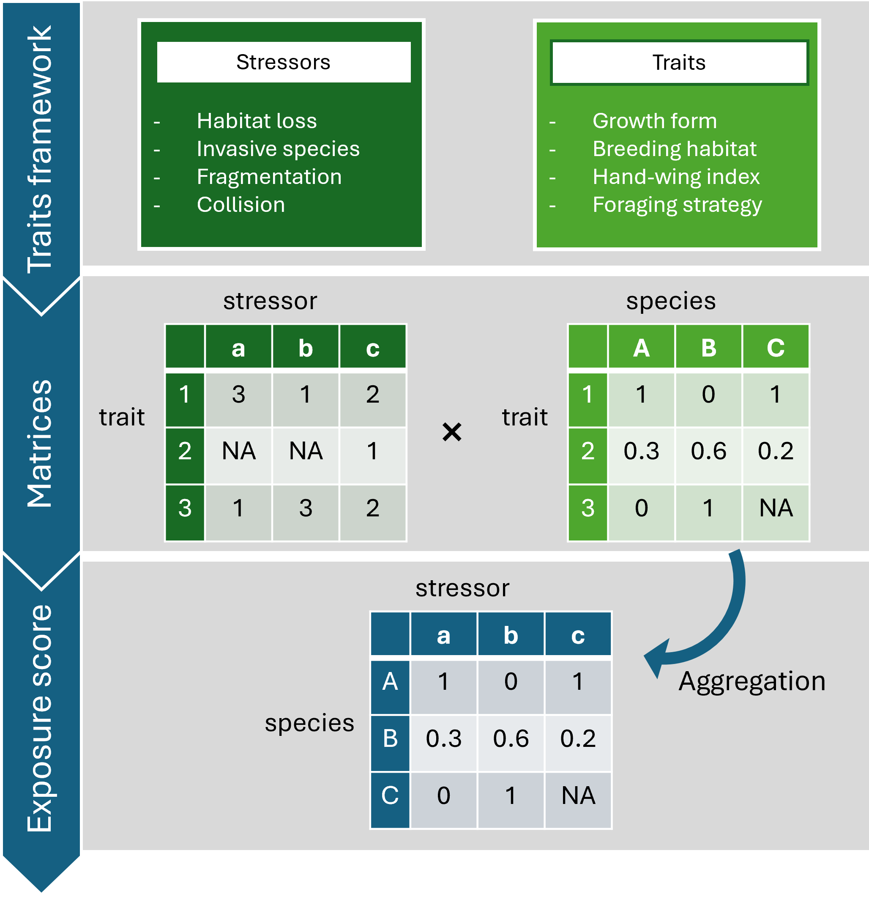

```{r tars, echo = FALSE, warning = FALSE, error = FALSE, message = FALSE}

library(targets)

# these tars only work inside a knit (otherwise use _targets.yaml directly)
tars <- yaml::read_yaml(here::here("_targets.yaml")) |>
  purrr::modify_tree(leaf = \(x) gsub("\\.\\.\\/\\.\\.", "../../..", x))

```

```{r setup, echo = FALSE, warning = FALSE, error = FALSE, message = FALSE}

# # load targets -------
tar_load_everything(store = tars$report_prep$store)
tar_load_everything(store = tars$envBird$database$store)
tar_load_everything(store = tars$envBird$birdcoin$store)
tar_load_everything(store = tars$birdraster$store)

#--------knitr options--------

knitr::opts_chunk$set(echo = FALSE
                      , warning = FALSE
                      , error = FALSE
                      , message = FALSE
                      , tidy = TRUE
                      , tidy.opts = list(comment = FALSE)
                      , eval.after = "fig.cap" 
                      , output_dir = here::here("report")
                      , progress = FALSE
                      # , dpi = 150
                      , fig.width = 6.5
)

#--------book options-------

options(knitr.kable.NA = ""
        , knitr.duplicate.label = "allow"
)

# --- tmap options ---

# view/plot mode
#depending on output format
is_html_output <-  function() {
  knitr::opts_knit$get("rmarkdown.pandoc.to")=="html"
}

if(is_html_output()) {
  use_tmap_mode <- "view"
} else {
  use_tmap_mode <- "plot"
  knitr::opts_chunk$set(fig.width = 6.5)
}

##or set manually
if(FALSE){use_tmap_mode <- "plot"}

tmap::tmap_mode(use_tmap_mode)

#suppress progress bars
terra::terraOptions(progress=0)

```

# Aim {-}

The goal of the species risk assessment is to develop a composite indicator of species vulnerability to development pressures, and to translate this into a spatially explicit three-tier zoning map. This map classifies areas as: (1) low risk to biodiversity values and generally suitable for development, (2) moderate risk requiring careful planning and mitigation, and (3) high risk and not suitable for development.

By integrating intrinsic species sensitivity with external pressures (including current, past, and projected impacts), the assessment identifies species most at risk and quantifies the level of pressure they face. This enables the evaluation of both existing and future development impacts.

The resulting spatial outputs are designed to support timely, evidence-based decision-making, guide development planning, and facilitate stakeholder discussions. The framework is flexible and can be adapted to specific development contexts, allowing risks to be reassessed as mitigation measures are incorporated.


<!--chapter:end:index.Rmd-->

# Introduction

## Renewable energy transition

South Australia is a global leader in the renewable energy transition, having increased the share of net renewable electricity generation from approximately 1% to 74% over just 16 years [@DEW2024]. The state has set ambitious targets, including achieving 100% net renewable electricity generation by 2027 and net zero emissions by 2050, supported by a legislated interim goal of reducing net greenhouse gas emissions by at least 60% by 2030.

This transition is underpinned by abundant wind and solar resources. As of 2021–22, 24 operational wind farms supplied more than 44% of the state’s electricity, while six large-scale solar farms, together with world-leading uptake of rooftop solar (installed on approximately 40% of homes), contributed over 24% [@DEW2024; @DCCEEW2025].

To facilitate further expansion, the state has identified key regions as pilot areas for renewable energy development in the semi-arid zone of South Australia, including the Upper Spencer Gulf (in the Gawler Ranges) and the Braemar region (Fig. \@ref(fig:pilotarea)).

---

## Bioregional planning

Bioregional planning is a critical strategic initiative designed to facilitate better, faster decision-making by establishing clear conservation priorities and identifying areas where these development can proceed with minimal environmental harm [@West2025]. It is essential for ensuring that the rapid expansion of renewable energy required for net-zero targets does not result in an unacceptable cost to nature, specifically by identifying high-risk areas early to address cumulative impacts that individual project assessments might miss. The framework prioritises siting wind and solar farms on previously modified or degraded landscapes, including agricultural lands, brownfields, and disused industrial sites, while avoiding fragile arid ecosystems and terrain features that concentrate bird or bat movements, such as ridges and important migratory routes. Ultimately, this proactive approach provides greater certainty for stakeholders and developers by streamlining approvals in low-risk areas and fostering outcomes where sustainable energy production and biodiversity restoration can coexist.

---

### Gawler Ranges {-}

The district is an ancient arid landscape characterised by calcrete plains, gypsum dune fields, and weathered rocky ranges (including rounded hills or bornhardts) that drain into extensive terminal salt lakes such as Lake Gairdner, Lake Acraman, and Lake Everard. Land use is dominated by large pastoral stations (primarily sheep and cattle), with additional activities including mining (notably iron ore), energy production, tourism, conservation, military use, and recreation. The only township, Iron Knob, has a small and declining population.

[Gawler Range District Plan](https://cdn.environment.sa.gov.au/landscape/images/saal/2024_DAP_GR.pdf)

### Braemar Province {-}

The Braemar Province is a major magnetite iron ore region in South Australia, located northeast of Adelaide near the NSW border, containing over 7-8 billion tonnes of defined ore. It is recognized for its potential to produce high-grade iron concentrate for green steel, though development is constrained by limited water and power infrastructure.

[North-east Pastoral District Plan](https://cdn.environment.sa.gov.au/landscape/images/saal/2024-26_DistrictPlan_NEP.pdf)

```{r pilotarea, echo=FALSE, fig.cap = "Location of the two pilot areas used in the species risk assessment framework: Upper Spencer Gulf/Gawler Ranges (400–500 km northwest of Adelaide) and Braemar Province (300–400 km northeast of Adelaide). Both are situated in the semi-arid zone of South Australia. Map produced by the GIS team, DEW (2025)."}

knitr::include_graphics("images/SA_PilotBioregionalAreas_Map_July2025_Rev.jpg")

```

<!--chapter:end:0010_INTRODUCTION.Rmd-->

## The Semi-arid Ecosystems

The Upper Spencer Gulf-Gawler Ranges and Braemar Province regions are dominated by chenopod and samphire shrublands and Acacia shrublands, interspersed with patches of Acacia woodland, Casuarina woodland, and Eucalyptus mallee forest mosaics ([envMap](http://spatialwebapps.environment.sa.gov.au/envmaps/?locale=en-us&viewer=envmaps#)). 

These semi-arid ecosystems are largely **fire-sensitive** and inherently fragile, with ecological processes strongly constrained by highly variable rainfall in space, time, and intensity. Vegetation regeneration is episodic and typically dependent on prolonged rainfall events, resulting in slow recovery following disturbance [@Lambers2018].

Despite this vulnerability, systematic biodiversity monitoring in chenopod and Acacia shrublands remains extremely limited, with most existing programs focused on the impacts of pastoral production rather than baseline ecosystem dynamics [@Recio2014]. Consequently, the ecological effects of large-scale vegetation removal and landscape modification in these systems remain poorly understood but are likely to result in long-term, and potentially irreversible, changes.

---

### ECO MAPS

<!--chapter:end:0011_arid-ecosystem.Rmd-->

## Ecosystem Impacts {#ecosystemimpacts}

### Wind and solar energy developments

#### Site preparation and construction {-}

This stage involves substantial vegetation removal and ground disturbance.

For solar farms, site preparation typically includes vegetation clearing, removal of root systems, and surface grading to maintain slopes below approximately 5%. Solar panels are then installed on steel frames supported by driven piles or screw foundations [@Turney2011].

Wind farm construction requires the development of access tracks (e.g., cut-and-fill or floating roads) and levelled crane pads for turbine assembly. Turbines are supported by large concrete foundations, which may be gravity-based, piled, or rock-anchored [@ScottishRenewables2010].

In both systems, grid connection infrastructure requires trenching for underground power and communication cables linking solar arrays, transformers, on-site substations, and transmission lines [@Bennun2021].

#### Roads {-}

Access roads are typically 14 feet wide for solar farms and 15 feet wide for wind farms and typically take the shortest route possible from the public road to minimize costs [Apex Clean Energy 2024](https://www.facebook.com/watch/?v=1981524348927083). The roads are constructed by flattening and compacting the ground surface, followed by gravel deposition to improve traction and reduce slipperiness in wet conditions [@VanHaaren2011].

Wind farms may require even more extensive and durable road infrastructure to accommodate large turbine components and heavy cranes, often demanding route assessments and structural reinforcement to support the transport of oversized loads ([Stantec](https://www.stantec.com/au/ideas/topic/energy-resources/overcoming-challenges-wind-turbine-transportation-why-route-assessments-are-critical)).

In some cases, road infrastructure may be extended beyond the development site to provide additional local community access as part of compensation or benefit-sharing measures.

The development and operation of renewable energy projects lead to a significant increase in vehicle movement, not only during construction but also during operation, decommissioning, and site rehabilitation. The access roads bring in materials such as earthworks, turbines, solar panels, supply-chain logistics as well as labour force such as operational and maintenance traffic and expanded workforce in the region ([CSIRO, Green hydrogen causal network for the Upper Spencer Gulf region in South Australia](https://causalnetworks.csiro.au/project/sustainable-hydrogen/network/usg-green-hydrogen)).

#### Operation and maintenance {-}

Once commissioned, renewable energy projects require ongoing monitoring and maintenance over operational lifespans of approximately 25–40 years. Key activities include routine inspections and vegetation management.

Routine inspections involve checking electrical systems, cleaning photovoltaic (PV) modules to maintain efficiency, and assessing the structural integrity of mounting systems and turbine components (e.g., blades).

Vegetation management is undertaken to minimise shading, prevent infrastructure damage, and reduce fire risk. In solar farms, vegetation is typically maintained below ~1 m in height. In remote regions of Australia, regular mowing is often impractical due to limited access and labour constraints; consequently, vegetation control is more commonly achieved through herbicide application or grazing.

Livestock grazing is increasingly used as an alternative management strategy to maintain low vegetation cover. This approach integrates renewable energy production with agricultural use and has been promoted for its potential co-benefits, including reduced maintenance costs, improved livestock welfare through access to shade, lower environmental impacts compared to herbicide use, and enhanced land-use efficiency [@Dinesh2016; @Silva2019; @Taylor2023; @Widmer2024; @CleanEnergyCouncil2025].

#### Decommissioning {-}

At the end of their operational lifespan, renewable energy installations may either be repowered or decommissioned. Repowering involves replacing older or obsolete turbines or solar panels with newer, more efficient technologies to extend the site’s productive life. Alternatively, decommissioning entails dismantling and removing infrastructure components, such as photovoltaic (PV) modules, steel towers, and nacelles, many of which can be recycled. Site rehabilitation is typically required and may include reinstating land to its original condition or an agreed future use, through actions such as replacing stored topsoil and revegetating disturbed areas [@ScottishRenewables2010; @Bennun2021].

However, waste management—particularly for solar panels—remains a significant challenge. The most common panel types in use are crystalline silicon (c-Si) and cadmium telluride (CdTe). CdTe panels are more efficient in energy conversion, but cadmium is a highly toxic and carcinogenic element. Both recycling and disposal processes can generate environmental impacts [@Maani2020], and there is a considerable risk of cadmium leaching from panels in landfill and contaminates soils and water resources [@Ramos-Ruiz2017].

---

### Potential impacts

#### Soil degradation and wind erosion {-}

Wind is a key abiotic driver of ecosystem dynamics in arid and semi-arid environments. As a result, wind erosion is one of the principal processes underlying land degradation in drylands and represents a major concern for land managers and policymakers worldwide [@Meyer2011; @Duniway2019]. The stability of these systems is highly dependent on vegetation cover, which protects soil surfaces and reduces aeolian transport.

Experimental studies demonstrate a strong, non-linear relationship between vegetation loss and both horizontal sediment transport and dust emissions. When ground cover loss exceeds approximately 75%, dust flux increases sharply, and complete vegetation removal can elevate vertical dust flux by up to twelvefold (reaching ~12 g m⁻² day⁻¹) during windy periods [@Li2007]. Disturbances associated with wind and solar energy developments—including vegetation clearing, construction activities, and ongoing maintenance—can therefore substantially increase susceptibility to erosion.

Additional disturbances such as fire and livestock grazing can further amplify these effects, increasing horizontal aeolian flux by up to an order of magnitude, and in some cases as much as fortyfold [@Duniway2019]. The resulting soil loss not only degrades site productivity but can also have broader environmental consequences, including reduced air quality and the redistribution of nutrients across the landscape.

#### Ecosystem degradation {-}

**Grazing pressure**

The use of livestock grazing to manage vegetation beneath and around solar infrastructure is increasingly promoted in agricultural systems. However, this approach is not suitable in semi-arid ecosystem. Grazing by domestic livestock is widely recognised as a major driver of ecosystem degradation in Australia, with long-lasting impacts on both vegetation structure and soil processes [@Lunt2007]. These impacts are often most pronounced in relatively intact ecosystems on low-productivity soils, where recovery from disturbance is slow.

In semi-arid mulga systems, increased grazing pressure has been shown to significantly reduce herbaceous cover and biodiversity compared to ungrazed areas, while also decreasing water infiltration and soil moisture retention [@Witt2011]. Grazing can also damage biological soil crusts, which play a critical role in stabilising soils, retaining moisture, and providing habitat for a range of organisms, including threatened species [@Belnap2001].

**Spread of invasive species**

Disturbance is a key driver of invasive species spread in arid ecosystems. Evidence from systems such as the Great Basin cold deserts shows that vegetation clearing and disturbance can facilitate the invasion of exotic grasses [@Wilcox2012].

At the community scale, livestock grazing is also a major driver of weed invasion in arid landscapes [@Belsky2000]. Livestock facilitate invasion through multiple pathways, including seed dispersal, selective removal of palatable native species, soil disturbance, and the breakdown of protective soil crusts. These processes favour the establishment of exotic annual species, which are typically more tolerant of grazing and fire and can outcompete native vegetation for limited water resources [@Gelbard2003]. While annual species may proliferate under grazing, native perennial species often decline, particularly under sustained grazing pressure [@Dorrough2004]. Consequently, even low levels of grazing may be incompatible with the conservation of some native plant communities.

Road construction and maintenance directly remove vegetation and create edges that increase exposure to invasive species, disease transmission, and ecological traps, as these transitional zones are often preferred by generalist and invasive species [@Ewers2006]. For example, invasive foxes use roads as dispersal corridors [@May1996; @Burrows2018], while vehicle tyres and human activity transport invasive plant seeds [@Burrows2018; @Friedel2020]. In semi-arid landscapes, roads increase exotic plant richness and cover, while reducing native species diversity in adjacent habitats [@Gelbard2003]. By creating disturbed environments that favour weeds, road networks act as long-term drivers of ecosystem transformation. Effective planning and maintenance must explicitly account for these risks to minimise cumulative ecological impacts.

**Change of fire regime**

The replacement of native shrublands with grass-dominated systems substantially alters fire regimes, as invasive grasses typically form continuous, highly flammable fuel layers that increase fuel loads and connectivity. This shift promotes more frequent and intense fires, initiating a positive feedback loop in which fire-tolerant invasive grasses are favoured over native, fire-sensitive shrub species [@Brooks2004; @Wilcox2012]. Over time, this process can drive irreversible ecosystem transformation and the loss of native plant communities.

In Australia, buffel grass (*Cenchrus ciliaris*) exemplifies these processes. Widely introduced as a pasture species, buffel grass has spread extensively across arid and semi-arid regions, where it can alter biodiversity and community composition even at low levels of cover [@Smyth2009]. It outcompetes native species for limited water and nutrients and significantly increases fire frequency and intensity [@McDonald2011]. These changes lead to declines in woody vegetation and reduced regeneration capacity of native flora, with persistence increasingly restricted to species capable of rapid post-fire recruitment [@Schlesinger2013]. In this way, invasive grasses act as a key mechanism linking disturbance to long-term ecosystem degradation in semi-arid landscapes.

#### Fragmentation and wildlife mortality {-}

Physical barriers such as fences and culverts restrict animal movement, while open roads can deter or fragment populations. Road networks have been linked to significant population declines, including 22.6% in birds and 97.9% in mammals [@Torres2016]. Vehicle collisions alone are estimated to remove over 10% of kangaroo and koala populations, and more than 25% of quolls and Tasmanian devils, with demographic impacts exacerbated by sex- and age-biased mortality in carnivorous mammals [@Moore2023]. Species with limited dispersal, sedentary habits, specialised habitats, or restricted distributions are particularly vulnerable to isolation and local extinction [@May1996].

#### Carbon storage {-}

Desert and semi-desert ecosystems cover approximately 22% of the Earth’s land surface and store around 8% of global terrestrial carbon [@Meyer2011]. A key feature of these systems is the dominance of stable soil organic carbon (SOC), which accounts for approximately 95% of total carbon storage in shrublands [@Meyer2011]. Unlike grasslands—where most root biomass is concentrated in the upper soil layers—desert shrublands allocate a substantial proportion of biomass belowground, contributing to slow carbon turnover and long-term carbon storage. Consequently, the loss of woody and perennial vegetation can reduce carbon sequestration capacity and shift these systems toward more transient, less stable carbon pools. Empirical estimates reflect this contrast, with desert woodlands and shrublands functioning as net carbon sinks, whereas desert grasslands may act as net carbon sources under certain conditions [@Taylor2017].


<!--chapter:end:0012_ecosystem-impacts.Rmd-->

## Species Risk Assessment

### Integration with species distribution models

At the current stage of bioregional planning, biodiversity is represented using the sum of a species distribution model (SDM) prediction stack, where species presence and absence are expressed as binary values (1 and 0). This approach enables biodiversity value to be mapped by visualising the number of concerned species predicted to occur within each spatial unit (e.g., pixel). In this context, concerned species include those that are nationally or state-listed, may be listed in the future, or have a high level of regional contribution (e.g., >30% of their distribution occurring within South Australia).

A key next step is the development of a consequence map, which moves beyond species presence to explicitly represent the risks faced by species under development pressures. Trait-based risk assessment is used to quantify the potential impacts of proposed activities on affected species. These quantified composite indicator is then integrated with SDMs to spatially represent risk, with the highest value across species summarised for each spatial unit. The resulting consequence map is classified using defined thresholds to delineate development zones, which are intended to guide decisions on the siting of proposed developments and land uses. In addition, the assessment can identify species-specific risks, enabling targeted avoidance measures and the design of appropriate mitigation strategies to be addressed within development applications.

---

### Trait-based approaches

Species traits are the measurable biological characteristics of organisms, including morphology, physiology, behaviour, and phenology, that shape their ecological performance and reveal the complex processes driving extinction risk [@Gallagher2021]. The large-scale integration of this information allows researchers to conduct meta-analyses across vast numbers of species to identify general trends in how biodiversity responds to human pressures. For instance, trait-based models have been successfully used to predict species sensitivity to habitat fragmentation [@Keinath2017], assess vulnerability to invasive predators such as feral cats [@Woinarski2017], and model responses to fire disturbances [@Pocknee2023].

The rapid expansion of international and national trait databases has been critical to these efforts. Key resources include EltonTraits for the foraging attributes of birds and mammals [@Hamish2014], TRY for global plant traits [@Kattge2020], and AusTraits for the Australian flora [@Falster2021], alongside many others curated through the [Open Traits Network](https://opentraits.org/).

Incorporating trait data into species risk assessments provides several important advantages. First, it enables more transparent and mechanistic evaluation of how different species respond to specific threats by explicitly considering intrinsic characteristics, rather than relying solely on conservation status. Traditional assessments often focus on metrics such as population size or extent of occurrence, which do not fully capture a species’ vulnerability to particular stressors. In contrast, trait-based approaches allow risk to be decomposed into key components, including sensitivity (the degree to which a species is affected by a stressor) and adaptive capacity (its ability to persist, adapt, or recover) [@Pacifici2015; @Butt2022].

Second, trait-based frameworks support predictive assessments by enabling the estimation of species-specific responses prior to the implementation of new developments or emerging threats. This is particularly valuable in data-limited contexts, where empirical impact data are unavailable [@Galic2024]. Increasingly, such approaches are being applied at broad taxonomic scales; for example, global analyses have used trait data to assess the vulnerability of tens of thousands of marine species to multiple stressors [@Butt2022], and to predict species’ susceptibility to climate change [@Pacifici2015].

By explicitly linking biological traits to threat responses, trait-based risk assessments provide a more nuanced and generalisable framework for evaluating biodiversity impacts. This approach supports a shift from reactive to proactive conservation planning, enabling more informed decision-making in the context of rapid environmental change.

---

### Limitations

Trait-based data are powerful tools for large-scale analyses and predictive modeling, but several limitations should be acknowledged when interpreting results:

1. **Simplification of organisms**

Traits are simplified, quantifiable representations of an organism’s characteristics. By focusing on measurable attributes across species, some information is inevitably lost, and only certain aspects of an organism are emphasised. Consequently, traits cannot fully capture the complexity of a species.

2. **Subjectivity in scoring systems**

To incorporate traits into a composite indicator framework, scoring systems are required. These systems are often tailored to the specific analysis and research questions, introducing subjectivity. Traits combined with scoring systems function like a model: while scoring involves judgment, transparency in methodology allows for proper interpretation and reproducibility.

3. **Knowledge gaps and data limitations**

Trait information relies on existing knowledge of a species. For poorly studied species, trait data may be incomplete or of limited use. If imputation is applied to fill gaps, it must be transparent, reproducible, and interpreted with caution to avoid overconfidence in the results.

4. **Lack of population and demographic information**

Trait data do not capture population size or demographic dynamics. However, these data are essential for species risk assessment and are sourced separately from spatial datasets such as IUCN, BirdLife Data Zone, or published studies.

---

### Scope of this report

In this report, the Upper Spencer Gulf and Braemar Province are used as pilot study areas, with renewable energy developments (wind and solar farms) as the focal development types. A total of 143 concerned bird species predicted to occur in these two pilot areas were utilised to develop the framework, as bird data is relatively rich for analysis. These case studies are used to design, implement, and demonstrate the proposed risk assessment framework and workflow.


<!--chapter:end:0013_species-risks.Rmd-->

# General Methods

## Trait and Indicator Selection

Species traits (e.g., migratory status, habitat use) and ecological indicators (e.g., extent of occurrence) were used to develop the scoring framework for quantifying species vulnerability. These variables were sourced using three complementary approaches: (1) existing trait databases, (2) extraction from species observation records, and (3) manual coding from published literature and online resources. Combining these approaches allows for broader trait coverage while balancing data availability and quality across species groups.

---

### Existing database

Trait information was sourced from established databases where available. The availability and quality of these databases vary across taxonomic groups: birds and freshwater fish are relatively well represented, while plants often have structured trait systems but remain data-deficient for many species. In contrast, mammals, reptiles, and amphibians currently lack comprehensive and well-populated trait databases.

**Advantages:**
Existing databases provide analysis-ready data with standardised coding, often developed and reviewed by experts (e.g., BirdBase or national compilations such as Garnett et al. 2014 for Australian birds). This facilitates efficient integration into modelling workflows.

**Limitations:**
Integrating multiple databases can be challenging due to differences in classification systems, variable definitions, and formats. Missing data are also common and may require imputation, which can introduce additional uncertainty.

---

### Extraction from observation records {#recextract}

Trait-related indicators were derived from cleaned species occurrence records (prepared as part of the SDM workflow). This approach is particularly useful for estimating spatially explicit characteristics, such as climate breadth or habitat use.

**Advantages:**
This method is entirely data-driven and avoids the need for imputation. It is especially valuable for data-deficient species, as it enables the derivation of ecological characteristics directly from observed distributions. It also allows uncertainty and variability to be quantified based on the underlying data.

**Limitations:**
Observation data are subject to several biases. These include sampling effort bias (uneven survey effort distorts habitat use), spatial accuracy issues (imprecise coordinates assigning records to incorrect locations), and detection bias (e.g., waterbirds recorded primarily along shorelines). In addition, species with few records may yield unreliable estimates. Importantly, this method is only applicable to traits that have a spatial signal; life-history traits such as migratory status or generation length cannot be derived in this way.

---

### Literature-based coding

Where data were not available from databases or could not be derived from occurrence records, traits were manually compiled from published literature, field guides, and credible online sources.

**Advantages:**
This approach allows the inclusion of important ecological and life-history traits that are otherwise unavailable, ensuring more complete trait coverage across species.

**Limitations:**
Manual coding can be time-intensive and may introduce subjectivity, particularly when translating qualitative descriptions into quantitative scores. Consistency in interpretation and documentation is therefore critical.

---

## Theoretical Framework

Designing the framework for constructing a composite indicator is a critical step, as it provides the theoretical foundation for selecting, structuring, and combining variables. This ensures that the resulting indicator appropriately captures and represents the complex, multidimensional phenomenon of interest [@OECD2008].

The first step is to clearly define the composite indicator—*species vulnerability*—which serves as the basis for spatial representation in this assessment. At its core, species vulnerability describes the susceptibility of a species to decline or extinction, reflecting its potential to be adversely affected by environmental and anthropogenic stressors. In this context, vulnerability is used as a practical construct to represent a species’ state of exposure and response to harm.

The definition of vulnerability can vary depending on the context and objectives of the assessment. More commonly, vulnerability frameworks incorporate three dimensions—sensitivity, adaptive capacity, and exposure—to provide a comprehensive assessment of species risk [@Foden2019; @Butt2022; @Hyman2025]. However, the dimensions can be customised depending on the aims and context of the assessment. For example, vulnerability has been defined as a function of sensitivity (the degree to which a species is affected by a stressor) and adaptive capacity (its ability to adapt to or recover from that stressor) when assessing human impacts on a broad range of marine species [@Butt2022].

In this pilot study, species vulnerability is defined as a function of three core, interacting dimensions: 

1. **Sensitivity:** the intrinsic degree to which a species, community, or ecosystem is affected by environmental disturbances or climatic variability. Due to limited availability of adaptability-related data, and its conceptual overlap with sensitivity, adaptive capacity is incorporated within the sensitivity dimension [@Hyman2025].

2. **Exposure:** the rate, magnitude, or intensity of environmental change, stressors, or human-driven disturbances that an individual, species, or population experiences.

3. **Cumulative Pressure:** the combined, interactive effects of multiple environmental stressors—such as habitat fragmentation, climate change, pollution, and invasive species—acting simultaneously or sequentially on a specific species or population over time. 

The inclusion of cumulative pressure provides important context by accounting for species that may not be intrinsically sensitive but are already under significant pressure due to ongoing or historical human activities and land-use conflicts. Where spatial data are available, current and anticipated development pressures beyond the study area can also be incorporated within this dimension to better reflect the overall risk profile of each species [@Bennun2021].

These dimensions provide a comprehensive and context-appropriate representation of species vulnerability, supporting the identification and spatial management of risks associated with future development and land-use planning.

---

### Steps of compressing information

The vulnerability index represents the highest level of the composite indicator (Level 4) and is supported by three sub-indices (Level 3) corresponding to the core dimensions of vulnerability: sensitivity, exposure, and cumulative pressure. Each of these dimensions is further structured into thematic sub-groups (Level 2), ensuring transparency and ecological relevance in the classification and organisation of the underlying traits and indicators (Level 1)(Fig. \@ref(fig:framework)).

```{r framework, fig.cap = "Overview of the vulnerability assessment framework, showing the aggregation of species traits into a composite index and its application in generating vulnerability and zoning maps."}

knitr::include_graphics("images/riskmap_framework.png")

```

Each thematic sub-group comprises one or more traits or indicators as variables. These variables were treated with log transformation where necessary and normalised using min-max approach [@OECD2008; @Becker2025]. Where multiple variables are included within a sub-group, they are aggregated using a specific aggregation method to construct the three primary sub-indices (Level 3), which form the basis for the vulnerability index (Fig. \@ref(fig:index)).

This hierarchical structure (Fig. \@ref(fig:index)) allows the composite indicator to be traced back to its underlying components, enabling analysis of its internal structure at each level. From a framework design perspective, it is also highly flexible, as traits and indicators can be readily added to or removed from thematic sub-groups. This supports ongoing refinement, allowing the relevance and contribution of each component to be transparently evaluated and updated over time.

```{r index, fig.cap = "Structure of the composite indicator used to construct species vulnerability. The overall index (Level 4: Vulnerability) is composed of three sub-indices at Level 3: Sensitivity, Exposure, and Cumulative Pressure, each representing a distinct dimension of vulnerability. Each Level 3 sub-index is further composed of multiple thematic sub-groups (Level 2), which group related traits and indicators that measure specific aspects of that dimension."}

library(DiagrammeR)

grViz("
digraph risk_index {

  graph [layout = dot, rankdir = TB, nodesep = 0.4, ranksep = 0.5]
  node [fontname = Helvetica, penwidth = 1.5]
  edge [color = black, arrowhead = none, penwidth = 1.5]

  # --- Top level ---
  node [shape = box, style = rounded, fillcolor = white]
  v     [label = 'Vulnerability']
  exp   [label = 'Exposure']
  sens  [label = 'Sensitivity']
  cum   [label = 'Cumulative\\npressure']

  # --- Grey boxes (fixed width) ---
  node [
    shape = box,
    style = filled,
    fillcolor = '#E0E0E0',
    color = white,
    fixedsize = true,
    width = 2.2
  ]

  # Exposure
  e1 [label = 'Habitat Loss']; 
  e2 [label = 'Invasive\\nPredators']
  e3 [label = 'Invasive\\nHerbivores']; 
  e4 [label = 'Fragmentation']
  e5 [label = 'Collision Solar']; e6 [label = 'Collision Wind']

  # Sensitivity
  s1 [label = 'Climate\\nSpecialisation']; 
  s2 [label = 'Habitat\\nSpecialisation']
  s3 [label = 'Diet\\nSpecialisation']; 
  s4 [label = 'Adaptability']
  s5 [label = 'Constraints']

  # Cumulative
  c1 [label = 'Threats']; 
  c2 [label = 'Trend']; 
  c3 [label = 'Status']

  # --- Structure ---
  v -> {exp sens cum}

  # --- Vertical lines ---
  exp  -> e1 -> e2 -> e3 -> e4 -> e5 -> e6
  sens -> s1 -> s2 -> s3 -> s4 -> s5
  cum  -> c1 -> c2 -> c3

  # --- Row alignment (keeps columns straight) ---
  {rank = same; e1; s1; c1}
  {rank = same; e2; s2; c2}
  {rank = same; e3; s3; c3}

}
")

```

---

### Mapping vulnerability

The species-specific vulnerability scores are spatially projected by overlaying them onto each species’ distribution model. These layers are then stacked, and for each spatial unit (pixel), the maximum vulnerability value across all species is extracted to represent the highest level of biodiversity risk at that location.

The maximum vulnerability values are classified into three risk-based zones using defined thresholds: (1) low risk to biodiversity values and generally suitable for development, (2) moderate risk requiring careful planning and mitigation, and (3) high risk and not suitable for development.

Condensing complex information into a single value inevitably results in loss of details. However, if this limitation is acknowledged and the underlying data are presented alongside the aggregated values, the composite indicator can effectively summarise the data and reveal overall trends and patterns [@OECD2008].

The framework integrates stable biological traits, current population trends, and dynamic future development pressures to provide a comprehensive assessment of risk. In addition to supporting timely and evidence-based decision-making, the composite indicator is designed to facilitate meaningful stakeholder engagement. This systematic and reproducible approach ensures that species with high intrinsic sensitivity or those subject to the greatest pressures are consistently identified in an analytically sound approach.

---

### Term definitions {-#definition}

Term definitions provide clear explanations of specific words and concepts used in this report.

* **Index** – The highest-level composite measure representing a multidimensional concept. In this study, the *vulnerability index* reflects overall species vulnerability, integrating sensitivity, exposure, and cumulative pressure across multiple species.

* **Sub-index** – A secondary-level component of a composite indicator that aggregates related thematic variables. In this study, sub-indices correspond to the core dimensions of vulnerability: **Sensitivity**, **Exposure**, and **Cumulative Pressure**.

* **Sub-groups** – Thematic clusters of related traits or indicators (Level 2) that are combined to form a sub-index. Sub-groups ensure ecological relevance and transparency in the organisation of variables.

* **Indicator** – A measurable variable or data point that quantifies a specific ecological attribute or pressure. Indicators are the building blocks of sub-groups and may be derived from traits, population data, or spatial datasets.

* **Trait** – A quantifiable characteristic of a species representing a specific biological or ecological attribute. Traits are used to assess intrinsic sensitivity or vulnerability to environmental and anthropogenic pressures. By definition, traits are directly observed and objective; they are not synthesized, processed, or derived information. For example, the extent of occurrence of a species is not considered a trait.

* **Variable** – A specific data field within a dataset used to represent or quantify a trait or indicator.

* **Database** – A curated collection of species traits, population metrics, distribution models, or environmental data sourced and organised by experts of a specific species group.

* **Vulnerability** – A species’ overall susceptibility to a specific development type, integrating its sensitivity, exposure, and cumulative pressures. Vulnerability serves as the core construct for spatial representation of species risk.

* **Risk zone** – A spatially defined area classified based on vulnerability scores, indicating levels of biodiversity risk and suitability for development.

---

### Reproducibility {-}

```{r lib, echo=FALSE}
library(envReport)
```

All analyses were conducted in a scripted workflow using the statistical computing environment ['R'](https://www.r-project.org/) `r cite_package("base")`. R is free and open-source software, commonly used by researchers from a range of fields for analyses and graphics. It can be extended by a range of open-source packages designed for specific analyses or other tasks, built by a large and active development community. The packages used in this project are listed in Appendix Table \@ref(tab:packages). R was used within the [R-studio](https://www.rstudio.com/) IDE (integrated development environment), which provides a range of user-friendly features to facilitate interaction with R such as a graphical user interface, project organisation, and integration with [git](https://git-scm.com/) and other version control systems.

The coding workflow is implemented using the `targets` package `r cite_package("targets")`. Targets manages complex coding pipelines by skipping tasks that are already up-to-date, and only running what is required. This allows for incremental changes to code without needing to rerun the full workflow from scratch, which may take several days.

The production of this report is part of this scripted and `targets`-wrapped workflow, using the markdown language implemented in R by the packages `rmarkdown` `r cite_package("rmarkdown")`, `knitr` `r cite_package("knitr")`, and `bookdown` `r cite_package("bookdown")`. This allows for any updates to the analysis to be automatically reflected in the report output.

All code is stored in a version control system (GitHub) at [https://github.com/dew-landscapes](https://github.com/dew-landscapes).


<!--chapter:end:0020_METHODS.Rmd-->

# Sensitivity

**Definition:** The degree to which a species is affected, either adversely or beneficially, by environmental disturbances or climatic variability. It is an inherent, intrinsic characteristic determined by the species’ biology, physiology, and ecological traits. Here, it is combined with adaptability, or adaptive capacity to include all the relative intrinsic traits. Adaptive capacity refers to the ability of a species to adjust, cope with, or respond to changing conditions to moderate potential damage, take advantage of opportunities, or survive in new environments.

---

## Thematic Sub-groups

Traits were selected following a comprehensive review of available trait databases and relevant literature on large-scale, cross-species meta-analyses. Selected traits were subsequently grouped into thematic subcategories to reflect key dimensions of species sensitivity.

Trait selection was informed by evidence from studies examining bird breeding success, establishment success, and responses to contemporary threatening processes at both global and Australian scales. While some traits are consistently identified as important predictors, others show variable significance across studies. Such variability is expected in broad-scale comparative analyses, where ecological relationships are influenced by local context, species-specific factors, and data limitations.

Accordingly, the selection prioritised traits with strong theoretical and empirical support, while acknowledging that no single set of traits can fully capture species sensitivity. As with any modelling approach, reducing complex biological systems to a simplified index involves trade-offs. However, the framework aims to provide evidence-based ecological reasoning and transparent methodology to develop composite indicators that are useful and interpretable of relative species vulnerability.

It is also important to acknowledge that the available evidence base is taxonomically uneven. Birds are disproportionately represented in trait-based studies and large-scale meta-analyses, and consequently provide the primary basis for trait selection and justification. However, the framework has been developed with generality in mind. In particular, core traits such as ecological specialisation (e.g., habitat, diet, and climate breadth) represent fundamental dimensions of species ecology and are broadly applicable across taxonomic groups. As such, while the current implementation is informed by avian data, the underlying structure of the framework is transferable and can be adapted as additional trait data become available for other taxa.

### Climate specialisation

Climate specialisation reflects the degree to which a species is restricted to a narrow range of climatic conditions. Species with limited climatic tolerance are more sensitive to environmental change, as they are less able to persist under shifting temperature and precipitation regimes. In contrast, climatically generalist species are more likely to withstand variability and adapt to novel conditions. 

### Habitat specialisation

Habitat breadth is a consistent predictor of species establishment success in novel environments [@Cassey2004; @Blackburn2009]. Species occupying a wide range of habitats within their native distribution are more likely to encounter suitable conditions elsewhere. Broad habitat tolerance reflects ecological generalism, which enhances survival in unfamiliar landscapes and increases the likelihood of successful establishment. Conversely, habitat specialists are more sensitive to environmental change due to their reliance on specific habitat types.

### Diet specialisation

Diet breadth is another key determinant of establishment success [@Cassey2004; @Blackburn2009]. Dietary generalists can exploit a wider variety of food resources, reducing dependence on specific prey that may be absent in new environments. Broad diets are associated with behavioural flexibility and environmental tolerance, both of which contribute to higher establishment success and lower sensitivity. In contrast, dietary specialists are more vulnerable to changes in resource availability.

### Adaptability

Adaptability is inherently difficult to quantify, as it encompasses complex behavioural, ecological, and evolutionary processes. It is often context-dependent and may reflect underlying genetic and phenotypic variation. In this study, adaptability is approximated using a species’ ability to utilise human-modified environments.

The capacity to forage in agricultural or urban landscapes has been shown to be negatively correlated with extinction risk [@Olah2024]. Species that make substantial use of human-modified habitats tend to exhibit greater ecological flexibility, reduced sensitivity to habitat disturbance, and lower overall extinction risk.

### Constraints

The constraints subgroup comprises traits that may limit a species’ ability to adapt to environmental change or successfully establish in novel environments. These traits capture different biological and ecological dimensions and vary in their relative influence on sensitivity. Below are some candidate traits and indicator that can be included in this subgroup. Traits and indicators can be added to or removed from this subgroup based on data availability and framework design.

#### Generation length {-}

Generation length represents the average age of breeding individuals in a population and reflects the rate of population turnover. It lies between the age at first reproduction and the age of the oldest breeding individuals, except in species that reproduce only once [@Bird2020].

As direct estimates of longevity are often difficult to obtain in wild populations, generation length provides a standardised and biologically meaningful proxy for life-history pace. Species with longer generation lengths generally have slower population turnover and reduced capacity to recover from disturbances, increasing their sensitivity to environmental change.

#### Range size (indicator) {-}

Although not a trait per se, range size is a key indicator of a species’ current ecological condition. It is strongly associated with both threat status and establishment success [@Cassey2004; @Blackburn2009; @Tobias2019; @Bird2020].

Species with large native ranges typically exhibit broader ecological tolerance and greater flexibility, increasing their likelihood of successful establishment. In contrast, species with small ranges are often more specialised, have smaller population sizes, and are therefore more vulnerable to environmental change and stochastic threats.

#### Restricted range {-}

The restricted range variable in BirdBase 2025 identifies species with a global range size < 50,000 km². Because the continuous range-size variable is log-transformed and scaled in the index, its influence may be diminished. Including a separate restricted-range indicator ensures that species with genuinely small distributions receive appropriate weighting.

This approach captures both naturally range-restricted species and those whose distributions have been reduced due to historical habitat loss, improving representation of vulnerability associated with limited geographic extent.

#### Raptor - Bird Only {-}

Raptors are apex or near-apex predators that typically require large home ranges and are sensitive to changes in prey availability. These ecological characteristics can increase their vulnerability to habitat loss and ecosystem disruption.

In addition, raptors are often more detectable and preferentially reported in observational datasets, which may introduce biases in data availability and interpretation.

#### Migratory - Bird Only {-}

Migratory behaviour is associated with reduced establishment success in novel environments [@Cassey2004; @Blackburn2009] and is a significant predictor of extinction risk [@Tobias2019].

Migratory species rely on seasonal movements and, in many cases, social cues to locate suitable habitats, increasing susceptibility to Allee effects. They must also identify and maintain access to both breeding and non-breeding sites, which can be challenging in unfamiliar or fragmented landscapes. Long-distance migrants are particularly vulnerable, as they depend on multiple, spatially separated habitats, increasing exposure to threats across their migratory routes.

---

## Traits or Indicators Not Included

The following traits were considered but ultimately excluded from the sensitivity index due to conceptual, methodological, or data-related limitations. In each case, the potential value of the trait was outweighed by issues of interpretation, bias, or inconsistency.

#### Elevational range {-}

Elevational range is often interpreted as a proxy for ecological generalism, as species occupying a wide range of elevations are assumed to tolerate broader climatic and habitat conditions. However, several issues limit its applicability in this study.

First, elevational data are typically derived from global databases (e.g., BirdBase, \@ref(birdbase)), which may include elevation ranges not relevant to the Australian context. For example, Brown Quail (*Synoicus ypsilophorus*) are recorded at elevations from 0 to 3700 m asl, far exceeding the highest peak in Australia (~2200 m asl). While locally derived estimates would be preferable, they require occurrence-based extraction methods, which introduce additional sampling biases (\@ref(recextract)).

Second, the ecological interpretation of elevational range is context-dependent. In Australia, where most landscapes are flat, species restricted to high elevations are often specialists with limited distributions. Using raw elevational ranges can therefore produce misleading results. For instance, lowland species (0–100 m) may appear more sensitive than montane species (1500–2000 m), despite having access to a broader extent of suitable habitat.

Potential solutions, such as categorising elevation into discrete bands, introduce further issues related to arbitrary thresholds and misclassification. Given these conceptual and methodological challenges, elevational range was excluded, as it is likely to introduce more bias than informative signal.

### Trophic level {-}

Trophic level is often associated with sensitivity, as apex predators (e.g., raptors) are typically more vulnerable to environmental change due to their position in the food web. However, incorporating trophic level introduces several complications.

While high trophic levels may indicate increased sensitivity, including this variable would inadvertently down-weight the vulnerability of specialised primary consumers (e.g., species dependent on specific seeds or fruits). Additionally, intermediate trophic groups such as insectivores and omnivores exhibit considerable dietary flexibility, making them difficult to classify meaningfully along a single gradient.

Given these inconsistencies and the risk of misrepresenting dietary specialisation, trophic level was excluded from the index.

### Population trend and conservation status {-}

Population trend and conservation status may appear to be useful indicators of sensitivity, as they reflect current species performance. However, these metrics primarily capture realised outcomes driven by external pressures (e.g., habitat loss, threats) rather than intrinsic biological traits.

Furthermore, these variables are dynamic and may change over time, reducing their suitability for comparative analyses. Their inclusion would also introduce taxonomic bias, as such data are widely available for birds but lacking for many other groups (e.g., plants).

For these reasons, population trend and conservation status were excluded to maintain a focus on intrinsic, trait-based sensitivity. However, these indicators were used to buid the sub-index "cumulative pressure".

### Body mass {-}

Body mass has been identified as a significant predictor in multiple studies, showing associations with breeding success [@Smart2024], establishment success [@Blackburn2009], and extinction risk [@Tobias2019]. However, these relationships are often inconsistent and context-dependent.

As a composite trait, body mass is correlated with multiple aspects of species biology, including life-history strategy, metabolism, and ecological interactions. This makes it difficult to interpret within a sensitivity index without confounding multiple underlying processes or over-weighting certain dimensions.

To capture life-history pace more directly and with greater interpretability, generation length [@Bird2020] was selected as a more appropriate proxy. Consequently, body mass was excluded.

### Nest type {-}

Nest architecture has been shown to influence breeding success, with enclosed nests generally associated with higher survival rates than open nests [@Smart2024]. However, nest type represents only one component of reproductive strategy.

Reproductive success is shaped by a broader suite of life-history traits, and the influence of nest type alone may be limited or context-dependent. Given its partial representation of reproductive dynamics, nest type was not included in the index. However, it is used in stressor-specific analysis when building the "exposure" sub-index.

### Mating system {-}

Mating system has been linked to both extinction risk [@Tobias2019] and establishment success [@Blackburn2009], with polygynous systems potentially increasing sensitivity through mechanisms such as Allee effects. Available datasets categorise mating systems into discrete classes (e.g., monogamy, polygyny, lekking).

However, avian mating systems are highly complex and often exist along a continuum, with widespread variation in extra-pair behaviour both within and among species. This complexity makes it difficult to define consistent and biologically meaningful thresholds for sensitivity scoring.

Given these challenges in classification and interpretation, mating system was excluded from the index.

---

## Mapping Traits and Indicators

```{r bird, results='asis', echo=FALSE}
avian <- knitr::knit_child("child/20_birdsens.Rmd", quiet = TRUE)
cat(avian, sep = '\n')
```


<!--chapter:end:0021_sensitivity-framework.Rmd-->

# Exposure

**Definition:** Exposure is defined as the rate, magnitude, or intensity of environmental change, stressors, or human-driven disturbances experienced by a species or population.

---

## Identification of Exposure Pathways

The broad impacts of renewable energy developments on semi-arid ecosystems in Australia are outlined in the Introduction-[Ecosystem Impacts](#ecosystemimpacts).

This exposure analysis focuses on species-level responses to key stressors associated with renewable energy infrastructure, including photovoltaic (PV) solar farms, concentrated solar power (CSP) facilities, and onshore wind farms. A comprehensive overview of these impact pathways is provided in *IUCN—Mitigating biodiversity impacts associated with solar and wind energy development: guidelines for project developers* [@Bennun2021].

### Impact Pathway Diagram

The impacts associated with the project footprint can be visualised using an impact pathway diagram (IPD). Grounded in conceptual modelling approaches, an IPD provides a systematic visual framework for integrating diverse sources of scientific evidence and illustrating how stressors originating from project activities propagate through the environment to affect ecological receptors [@IESC2024].

```{r ipd, echo=FALSE, results='asis'}

ipd <- knitr::knit_child("child/20_exposure-ipd.Rmd", quiet = TRUE)
cat(ipd, sep = '\n')

```

Drawing on the above framework, the following stressors were identified and synthesised for inclusion in the analysis.

---

## The Stressors

To ensure the index remains both ecologically meaningful and analytically tractable, only a subset of exposure pathways was included, based on their ecological significance, data availability, and relevance to species-level risk.

Global evidence identifies habitat loss, invasive species, and exploitation as the primary drivers of recent extinctions across 615 species [@Saban2025]. While invasive species contribute the largest proportion of extinctions globally (38.0%), habitat loss is the dominant driver in mainland systems (51.1%), with invasive species (16.5%) and exploitation (15.5%) playing secondary roles.

Within the scope of this assessment, exploitation is not considered a relevant pressure, as none of the focal species are subject to harvesting. Pollution, although recognised as an additional driver of biodiversity loss, contributes relatively little to extinction risk (5.1% globally; 11.4% for mainland extinctions) and is therefore not prioritised here.

Accordingly, the index focuses on the two most influential and context-relevant pressures: habitat loss and invasive species. These pressures form the basis of the thematic subgroups included in the exposure analysis.

Below section outlines literature review and justification for each selected stressor.

---

```{r habitatloss, echo=FALSE, results='asis'}
knitr::knit_child("child/20_exposure-habitatloss.Rmd", quiet = TRUE) %>% 
  cat(sep = '\n')
```

---

```{r invasive, echo=FALSE, results='asis'}
knitr::knit_child("child/20_exposure-invasive.Rmd", quiet = TRUE) %>% 
  cat(sep = '\n')
```

---

```{r fragmentation, echo=FALSE, results='asis'}
knitr::knit_child("child/20_exposure-fragmentation.Rmd", quiet = TRUE) %>% 
  cat(sep = '\n')
```

---

```{r fire, echo=FALSE, results='asis'}
knitr::knit_child("child/20_exposure-fire.Rmd", quiet = TRUE) %>% 
  cat(sep = '\n')
```

---

```{r collision, echo=FALSE, results='asis'}
knitr::knit_child("child/20_exposure-collision.Rmd", quiet = TRUE) %>% 
  cat(sep = '\n')
```

---

## Trait–Stressor Matrix

In contrast to sensitivity, which reflects intrinsic properties of a species, exposure can be assessed across species using a common scoring framework. This enables comparative analysis with all species evaluated within a unified structure. Such an approach has been applied in [@Butt2022], where approximately 44,000 marine species were assessed for exposure and sensitivity across 22 anthropogenic stressors (see Fig. 1 in [@Butt2022] for the methodological framework). While that framework integrates both expert elicitation and literature review, this study relies solely on evidence derived from the literature.

The analysis is based on the construction of two matrices:

1. **Trait–species matrix**
Rows represent traits and columns represent species. Each cell contains the value of a given trait for a species, which may be binary (e.g., presence/absence) or continuous.

2. **Trait–stressor matrix**
Rows represent traits and columns represent stressors (or thematic sub-groups). Each cell contains a score representing the relevance or influence of a given trait under a specific stressor.

These matrices are combined through matrix multiplication to derive species-level exposure scores for each stressor. The resulting values can then be summed or aggregated to produce an overall exposure score per species per stressor.

Where trait data are unavailable for a species, or where a trait is not applicable to a given stressor, values are treated as missing (NA) and excluded from the calculation.

```{r buttfig1, echo=FALSE, out.width="50%", fig.align = 'center', fig.cap="The trait–stressor matrix framework used for exposure–sensitivity analysis, reproduced from Fig. 1 in Butt et al. (2022)."}



```

---

## Thematic Sub-groups

The identified stressors were consolidated into a set of thematic sub-groups for the trait–stressor matrix analysis. These sub-groups represent distinct and ecologically meaningful impact pathways:

- **Habitat loss**

- **Invasive predators (cats)**

- **Invasive herbivores (rabbits and goats)**

- **Increased fire frequency**

- **Collision (solar panels)**

- **Collision (wind turbines)**

These thematic sub-groups were derived from the literature review of individual stressors and the impact pathway diagram (IPD). They provide a flexible framework that can be refined as new information becomes available, allowing for the modification, addition, or removal of sub-groups as needed. Importantly, each sub-group can also serve as a basis for targeted mitigation strategies if needed.

```{r expmatrix, echo=FALSE}

m <- readxl::read_excel(fs::path(here::here(), "..", "TraitsMeta",
                                     "ExposureTraits.xlsx"),
                            sheet = "StressorTraitMapping")
m %>%
  dplyr::mutate(
    Trait = stringr::str_wrap(Trait, 20),
    birdcol_original = stringr::str_wrap(birdcol_original, 20),
    birdcol_new = stringr::str_wrap(birdcol_new, 20)
  ) %>%
  knitr::kable(
    caption = "Trait–stressor matrix linking traits and variables to the identified stressors (thematic sub-groups) across plant and animal species. Trait categories are scored, and non-applicable entries are treated as NA."
  ) %>%
  kableExtra::kable_styling(
    position = "left",
    bootstrap_options = c("striped", "hover", "condensed"),
    full_width = TRUE,
    font_size = 12
  ) %>% 
  kableExtra::column_spec(
    1:4,
    extra_css = "position: sticky; background-color: white; left: 0; z-index: 10;"
  ) %>%
  kableExtra::scroll_box(
    width = "100%",
    height = "500px",
    fixed_thead = TRUE
  )

```

## Potential Stressors Not Included

### Habitat degradation

Habitat degradation encompasses a range of indirect effects that alter environmental conditions, in addition to altered fire regime and habitat fragmentation:

* **Hydrological change:** Alterations to water availability, with largely unknown species-level responses

* **Microclimate change:** Localised changes in temperature, shading, and humidity, which are difficult to quantify directly

* **Pollution:** Potential impacts from dust, chemicals, and other contaminants

* **Ecosystem services:** Broad system-level changes that are complex and difficult to attribute at the species level

Nevertheless, these processes are challenging to quantify explicitly and are partially captured through the sensitivity component of the framework.

<!--chapter:end:0022_exposure-framework.Rmd-->

# Cumulative Pressure

**Definition:** the combined, interactive effects of multiple environmental stressors—such as habitat fragmentation, climate change, pollution, and invasive species—acting simultaneously or sequentially on a specific species or population over time. 

---

## Thematic Sub-groups

Exposure scores estimate the future pressures a species may face, while sensitivity reflects its intrinsic capacity to cope with environmental change. However, an additional index is needed to capture the cumulative threats already acting on a species. IUCN threat assessments provide this context by incorporating pressures occurring beyond the study area, thereby reflecting the overall population status. This accounts for situations where species with low intrinsic sensitivity may nonetheless be highly threatened due to land-use conflict or overlap with intensive human activities.

### Threats

The IUCN Threat Impact Scoring System provides a structured framework for classifying and ranking the impact of threats on individual species based on the [IUCN threat classification scheme](https://www.iucnredlist.org/resources/threat-classification-scheme) [@Ward2020]. It evaluates threats across three key dimensions: Timing (whether the threat is past, ongoing, or future), Scope (the proportion of the population affected), and Severity (the magnitude of population decline caused). Scores from these components are combined to derive an overall threat impact, which is categorised as high, medium, low, or negligible (Table @ref(tab:threatscore)). This approach enables consistent differentiation between minor and high-impact threats.

In this study, threat scores were assigned following the framework in Table 2 of [@Ward2020], with one modification. The original system assigns a score of 0 to threats classified as “unknown”; here, a non-zero value (1) was used to account for the possibility that such threats may be severe but poorly documented.

```{r threatscore, echo=FALSE, results='asis'}

knitr::knit_child("child/20_exposure-threatscore.Rmd", quiet = TRUE) %>% 
  cat(sep = '\n')

```

The IUCN threat classification scheme is hierarchical, with Level 1 categories subdivided into more detailed Level 2 and Level 3 threat types. This structure enables the derivation of multiple variables that capture different aspects of threat exposure.

The following variables were defined:

* **t_n_lv1** – Total number of individual Level-1 threat types
* **t_n_lv2_total** – Total number of individual Level-2 threat subtypes
* **t_score_max_sp** – Standardised maximum impact score among Level-1 threats
* **t_score_sum_sp** – Sum of standardised Level-1 threat scores

The variable **t_score_sum_sp** best represents the cumulative impact of all threats affecting a species. It is calculated as the sum of the maximum threat impact scores within each Level-1 category, thereby integrating the effects of severity, scope, and timing into a single metric. High values of of this variable indicate that a species is subject to strong and widespread pressures across its range, even if these pressures arise from a limited number of threat categories.

By standardising scores at the Level-1 category, this approach avoids bias arising from unequal numbers of sub-threats within different IUCN categories. As a result, the metric reflects the overall magnitude of environmental pressure experienced by a species, rather than simply the number of recorded threats.

### Population trend

Population trend was incorporated by assigning ordinal scores based on IUCN trend categories (e.g., increasing, stable, decreasing, unknown), with unknown values treated as stable.

```{r trend}
trend_scores <- data.frame(
  Trend = c("Decreasing", "Stable", "Increasing", "unknown"),
  Score = c(2, 1, 0, 1)
)

kbl(trend_scores, align = c("l", "c")) %>%
  kable_styling(full_width = FALSE)
```

### Popluation status

Population status was incorporated using IUCN Red List categories, with scores assigned based on conservation status. Categories include Critically Endangered (CR), Endangered (EN), Vulnerable (VU), Near Threatened (NT), and Least Concern (LC), ranked from highest to lowest conservation concern.

For species not assessed by the IUCN, population status was inferred from estimates provided by the Department for Environment and Water (DEW) bioregional team, based on spatial analyses aligned with IUCN assessment methodology.

```{r status}
status_scores <- data.frame(
  Status = c("CR", "EN", "VU", "NT", "LC"),
  Score  = c(5, 4, 3, 2, 1)
)

kbl(status_scores, align = c("l", "c")) %>%
  kable_styling(full_width = FALSE)
```


<!--chapter:end:0023_pressure-framework.Rmd-->

# Process Data {#dataprocess}

Following the selection of traits and indicators, data were processed prior to aggregation into a composite indicator [@OECD2008]. This typically involves several key steps: imputation of missing values, transformation of variables where necessary, and normalisation to ensure all variables are on a comparable scale.

Imputation addresses gaps in the dataset, while transformation may be applied to improve distributional properties or interpretability. Normalisation ensures that variables are bounded within a common range, allowing them to be meaningfully combined. Finally, variables are weighted and aggregated across hierarchical levels to produce composite indicators.

A wide range of methods exists for each of these steps, from simple to highly complex approaches. The choice of method can substantially influence the final results, including the relative scores assigned to species [@OECD2008].

---

## Imputation

The simplest approach to handling missing data is **single imputation**, where each missing value is replaced with a single estimate. This value may be derived from summary statistics (e.g., group mean or median) or from donor-based methods such as hot-deck or cold-deck imputation, where missing values are substituted using data from similar observations or external sources [@OECD2008].

**Multiple imputation** is a model-based approach that has gained increasing popularity [@Blomberg2025]. Rather than assigning a single value, it generates multiple plausible values for each missing entry, allowing uncertainty to be quantified. These approaches range from multivariate statistical models to Bayesian and machine learning models [@VanBuuren2011; @Penone2014].

There is no universally optimal imputation method, and the choice depends on data structure (categorical vs. continuous) and the underlying missingness mechanism (e.g., missing at random vs. not at random). In trait datasets, variables are often categorical and missingness is mostly dependent on taxonomy or trait types, which poses challenges for model-based approaches. In addition, when missing rates exceed approximately 30% for a given trait, imputation results become unreliable [@Penone2014].

Although multiple imputation performs well for continuous data, it has several limitations for trait-based analyses. In practice, downstream analyses often require a single value per observation, meaning that the uncertainty captured during imputation is not fully retained. This issue is particularly pronounced for categorical traits, where misclassification cannot be mitigated by probabilistic estimates, regardless of model complexity [@Gendre2024]. Furthermore, model-based imputation may introduce biologically unrealistic values if predictions rely on irrelevant or weakly related information [@Gorne2025].

Given the low proportion of missing data and the sensitivity of species risk assessments to misclassification, hot-deck and cold-deck single imputation methods were applied to the bird trait dataset. Imputed values were recorded separately in an Excel file to ensure transparency, enabling traceability and future updates as improved data sources become available.

---

## Data Treatment

Variables spanning large ranges were log-transformed to improve comparability and reduce skewness. Extent of occurrence ($\text{km}^2$) was transformed using $\log_{10}$, and generation length (years) using the natural logarithm.

---

## Normalisation

Indicators in raw datasets often use disparate units (e.g., counts, years, scores, area), making direct comparison difficult. Normalisation addresses this by rescaling indicators onto a common scale.

In this study, min–max normalisation was applied unless otherwise specified. This method linearly rescales values to a fixed interval (typically 0–1 or 0–100), preserving relative differences between observations. It is widely used in policy analysis and environmental modelling due to its simplicity and interpretability.

However, several properties require consideration. Min–max normalisation is sensitive to outliers, as extreme values can compress the distribution of other data points into a narrow range. It can also inflate variation when the original data exhibit limited spread, potentially exaggerating minor differences.

---

## Weighing 

Weighting assigns relative importance to individual indicators within the overall framework. Weights represent value judgements and may be based on theoretical relevance, stakeholder priorities, or statistical properties of the data [@OECD2008; @Linden2021].

Weighting can serve several purposes: (1) reflecting policy priorities by emphasising more critical components (e.g., threatened species in a conservation index), (2) correcting for redundancy by reducing the influence of highly correlated indicators, and (3) balancing information transfer to ensure that each indicator contributes meaningfully to the final score.

In this study, equal weighting was used as a baseline, with each indicator and composite indicator assigned a weight of 1. Weights were distributed hierarchically from higher to lower levels, such that the contribution of each subgroup depends on the number of groups within its parent index. Consequently, a subgroup within larger sub-index (e.g., composed of five subgroups) have a lower overall contribution than those within smaller sub-index (e.g., composed of two subgroups). Targeted weight adjustments were applied where necessary to reflect theoretical importance and maintain balanced contributions across indicators.

---

## Aggregation

Aggregation is the process of combining multiple indicators into a single composite score, providing a simplified representation of overall performance that is easier to interpret than a large set of individual metrics [@Linden2021]. Despite this simplification, a well-designed index should remain transparent and decomposable, allowing underlying drivers of the final score to be identified [@OECD2008].

The choice of aggregation method determines the degree of compensability—whether strong performance in one component can offset poor performance in another.

In this study, aggregation methods were selected based on the context of species risk assessment. A combination of approaches such as arithmetic means (allowing full compensation), geometric mean (no compensation), selecting the maximum value within a subgroup(limiting factor) were applied to test the performance and reflect different ecological processes and risk dynamics.

---

## The Workflow

Data processing was implemented using the `COINr` [R package](https://bluefoxr.github.io/COINr/index.html) [@Becker2025], which provides a structured and reproducible framework for constructing composite indicators following [@OECD2008]. 

Although developed in the social and economic sciences, this framework is well suited to trait-based species risk assessment, as both involve integrating heterogeneous variables, handling missing data, normalising and aggregating information across multiple dimensions. `COINr` provides a standardised and traceable workflow within the R environment, supporting rigorous implementation and transparent documentation of analytical decisions, as well as facilitating comparison of alternative methodological choices [@Becker2025].

In this study, the framework was adapted to prioritise interpretability. Rather than promoting a single aggregated index for decision making, the workflow enables efficient deconstruction of results, allowing detailed examination of individual indicators and their contributions to overall risk.


<!--chapter:end:0024_process-data.Rmd-->

# Results

## The Raw Coin

The raw coin contains all variables considered as candidate indicators. These variables have passed initial data checks and are ready for processing; however, none of the data processing steps mentioned in the Method section \@ref(dataprocess) have been applied at this stage. The raw coin therefore serves as a raw dataset from which variables can be included or excluded in subsequent analyses.

---

## The Base Coin

The Base Coin consists of a selected subset of candidate indicators from the Raw Coin and serves as the baseline for the risk assessment. Only essential log transformations were applied to variables with large numbers. All other data processing steps followed default methods, including min–max normalisation and arithmetic mean aggregation.

Below is a detailed demonstration of a Base Coin.

```{r basecoin, echo=FALSE}

targets::tar_source(fs::path(here::here(), "..", "envBird", "R", "coin"))

## Name variable for knitting child
h_df <- coin_1$Meta$Ind %>% 
  dplyr::select(iCode, Parent, iName, Weight) %>% 
  dplyr::mutate(Percentage = Weight)

coin <- coin_1
  
```

### iMeta of a Coin

Metadata structure of a coin. Each variable (candidate indicator) is identified by its `iCode` and grouped under a corresponding parent category. Weight indicates the contribution of each indicator during aggregation to the next level, while `iName` provides a descriptive label for each variable.

```{r imeta, echo=FALSE}

coin$Meta$Ind %>% 
  kableExtra::kbl(
  ) %>%
  kableExtra::kable_styling(
    bootstrap_options = c("striped", "hover", "condensed"),
  ) %>% 
  kableExtra::column_spec(2, extra_css = "position: sticky; background-color: white; left: 0; z-index: 10;") %>%
  kableExtra::scroll_box(width = "100%", height = "500px")

```

### iData of a Coin

Each unit is identified by the `uCode` column, while the remaining columns represent variables (candidate indicators) corresponding to `iCode` entries defined in the metadata

```{r idata, echo=FALSE}

coin$Data$Raw %>% 
  kableExtra::kbl(
  ) %>%
  kableExtra::kable_styling(
    bootstrap_options = c("striped", "hover", "condensed")
  ) %>% 
  kableExtra::column_spec(2, extra_css = "position: sticky; background-color: white; left: 0; z-index: 10;") %>%
  kableExtra::scroll_box(width = "100%", height = "500px", fixed_thead = TRUE)

```

---

### Structure

```{r basechild, echo=FALSE, results='asis'}

library(plotly)
library(htmlwidgets)
library(patchwork)

cat(knitr::knit_child(
    "child/30_CoinDisplay.Rmd",
    envir = list2env(list(
      coin = coin,
      coin_name = "Base",
      h_df = h_df
    )),
    quiet = TRUE
  ))

```

---

### Internal consistency {#internalconsist}

<!--chapter:end:0030_RESULTS.Rmd-->


## Adjustments

Several alternative configurations were implemented to test and refine the representation of vulnerability.

### Weight

**w1 Coin (\@ref(w1)):**

* The weights assigned to solar and wind collision were reduced to 0.5, reflecting their comparatively lower population-level impacts relative to other stressors.

These weight adjustments were applied across all subsequent coin configurations.

### Aggregation {#aggmethod}

1. **Max-Lv1 Coin (\@ref(Max-Lv1)):** Level 1 indicators were aggregated using a limiting-factor approach (i.e., selecting the maximum value), while all other aggregation steps followed the Base Coin (arithmetic mean).

2. **Max-Lv2 Coin (\@ref(Max-Lv2)):** Level 2 indicators were aggregated using a limiting-factor approach, while all other aggregation steps followed the Base Coin (arithmetic mean).

3. **Agg-gmean Coin (\@ref(Agg-gmean)):** All aggregation levels were calculated using the geometric mean, a method that penalize low scores and unbalanced values.

Unlike the max-based or arithmetic mean approaches, the geometric mean is applied at the indicator level for each unit, meaning that the contribution of each indicator varies across units depending on their relative values. As a result, the hierarchical structure of this coin cannot be represented in a fixed additive form or readily visualised as a standard aggregation tree.

```{r adjustcoins}

# Adjust weight for collisions and level 1 indicator aggregation
coin_11 <- coin_1
w1 <- coin_11$Meta$Weights$Original
w1$Weight[w1$iCode == "CollisionWind"] <- 0.5
w1$Weight[w1$iCode == "CollisionSolar"] <- 0.5
coin_11$Meta$Weights$w1 <- w1
coin_11 <- COINr::Aggregate(coin_11, dset = "Normalised", 
                            w = "w1",
                            regen = TRUE)

## Adjust aggregation method: Lv1-Lv2 max
coin_12 <- COINr::Aggregate(coin_11, dset = "Normalised", 
                            w = "w1", 
                            # narm_max stored in envBird/R/coin
                            f_ag = c("narm_max", "a_amean", "a_amean"), 
                            regen = TRUE)

## Adjust aggregation method: Lv2-lv3 max
coin_13 <- COINr::Aggregate(coin_11, dset = "Normalised", 
                            w = "w1", 
                            f_ag = c("a_amean", "narm_max", "a_amean"),
                            regen = TRUE)

## Adjust aggregation method: all levels gmean
coin_14 <- coin_11
coin_14$Log$Normalise$global_specs <- list(f_n = "n_minmax",
                                           f_n_para = list(l_u = c(1,100)))
coin_14 <- COINr::Regen(coin_14) %>% 
  COINr::Aggregate(dset = "Normalised",
                   w = "w1", 
                   f_ag = "a_gmean")

```

```{r h_df}

# Make a list of h_df for plot_coin_hierarchy ----

## Level 3
cols <- c("Sensitivity", "Exposure", "Pressure")

## Level 2
cols2 <- coin_1$Meta$Ind %>% 
  filter(Level == 2) %>% 
  select(iCode) %>% 
  unique() %>% 
  .$iCode

## ---------

coins <- list(
  "w1" = coin_11,
  "Max-Lv1"  = coin_12,
  "Max-Lv2"  = coin_13,
  "Agg-gmean" = coin_14
)

## ---------

hdf_list <- list(
  "w1" = coin_11$Meta$Ind %>% 
    dplyr::select(iCode, Parent, iName) %>% 
    dplyr::left_join(coin_11$Meta$Weights$w1, by = "iCode") %>% 
    dplyr::mutate(Percentage = Weight),
  
  "Max-Lv1" = extract_coin_maxcol(coin_12, cols2) %>% 
    dplyr::left_join(coin_12$Meta$Weights$w1, by = "iCode") %>% 
    dplyr::mutate(Percentage = Percentage*Weight),
  
  "Max-Lv2" = extract_coin_maxcol(coin_13, cols) %>% 
    dplyr::left_join(coin_13$Meta$Weights$w1, by = "iCode") %>% 
    dplyr::mutate(Percentage = Percentage*Weight),
  
  "Agg-gmean" = data.frame(
    Parent = "root",
    iName = "root_child",
    Percentage = 1) # Dummy df
)

```

---

## Adjusted coins

```{r rendercoins, results='asis'}

for (nm in names(coins)) {

  cat(knitr::knit_child(
    "child/30_CoinDisplay.Rmd",
    envir = list2env(list(
      coin = coins[[nm]],
      coin_name = nm,
      h_df = hdf_list[[nm]]
    )),
    quiet = TRUE
  ))
}

```
---

<!--chapter:end:0031_adjust-coin.Rmd-->

## Comparisons

Because the proportion of dominance pairs is low (in this study the it is zero; see Section \@ref(internalconsist)), the final results are highly sensitive to the choice of methodology. Therefore, composite indicator scores are compared across different methods (\@ref(aggmethod)) to assess the effect of method choice and to properly interpret the results.

```{r coinresults}
coin_results <- list()
coin_results<- lapply(coins, 
       function(x){COINr::get_results(x, dset = "Aggregated", tab_type = "Aggs")})
```

### Level 3

When aggregated to Level 3, the max-based approach shifts the distribution of scores towards higher values, whereas the geometric mean produces a more centralised distribution with a pronounced peak at lower values. This occurs because the geometric mean penalises low scores, reducing overall values when a species has uneven performance across indicators.

In contrast, the max-based method increases overall scores by selecting only the highest contributing indicator at each aggregation step. This effect is more pronounced when applied at Level 2 than at Level 1, resulting in a stronger rightward shift in the distributions. For Sensitivity and Pressure, the Level 2 max-based approach also produces a bimodal pattern, separating species into two distinct groups.

```{r lv3comp, echo=FALSE, message=FALSE, fig.cap="Density plots comparing the distribution of scores across methodologies, highlighting differences in central tendency and spread."}

plot_list <- compare_density_multi(coin_results, cols)
# print without showing list names/indices
purrr::walk(plot_list, print)

```

--- 

### Level 2

Density plot comparisons can likewise be conducted for Level 2 indicators. However, the `Max-Lv2` method is excluded from this analysis, as the methodological change is not relevant at this level of aggregation.

```{r lv2comp, fig.height=15}
plot_list <- compare_density_multi(coin_results[-3], cols2)
patchwork::wrap_plots(plot_list, ncol = 2) +
  patchwork::plot_layout(guides = 'collect',
                         axis_titles = "collect") & 
  theme(legend.position = 'bottom',
        legend.key.size = unit(1, "cm"))
```

---

### Score comparisons

The final Vulnerability scores were compared in the following table sorted by the scores of `w1` baseline.

```{r vulntable}

vulntable <- COINr::compare_coins_multi(coins, 
                                        dset = "Aggregated", 
                                        iCode = "Vulnerability",
                                        also_get = c("uName"),
                                        tabtype = "Values",
                                        ibase = 1,
                                        sort_table = TRUE,
                                        compare_by = "scores") %>% 
  dplyr::mutate(across(where(is.numeric), round, digits = 1)) %>% 
  dplyr::select(-uCode)


vulntable %>% kableExtra::kbl() %>%
  kableExtra::kable_styling(
    bootstrap_options = c("striped", "hover", "condensed")) %>% 
  kableExtra::scroll_box(width = "100%", height = "500px", fixed_thead = TRUE)

```

---

### Rank change

```{r ranktable}

rank_table_gt(vulntable, uName, names(coins), ref_col = "w1")

```


<!--chapter:end:0032_comparisons.Rmd-->

# References {-}

<div id="all_refs"></div>

<!--chapter:end:0040_References.Rmd-->

# (APPENDIX) Appendices {-}

<!--chapter:end:0050_APPENDIX.Rmd-->

# Bird Database {#bird-database}

This section outlines the expert-curated trait databases used in this project. For each database, a summary of its scope, taxonomic and geographic coverage, and the proportion of missing data is provided. Where available, metadata describing each trait variable—including definitions and data types—are also presented.

```{r birddb, echo=FALSE, results='asis', quiet=TRUE}

targets::tar_source(fs::path(here::here("R")))

child_files <- list.files(
  path = fs::path(here::here(), "report", "child"),
  pattern = "^51_.*\\.Rmd$", # regex: starts with 51_ and ends with .Rmd
  full.names = TRUE
)

for (f in child_files) {
  cat(knitr::knit_child(f, quiet = TRUE), sep = "\n")
}

```


<!--chapter:end:0051_bird-database.Rmd-->

## Species Profile

```{r spcoindf}

coin <- coins[["w1"]]

## df for Lv3 bar ----

df <- COINr::get_results(coin, dset = "Aggregated", tab_type = "Aggs") %>% 
  left_join(coin_11$Meta$Unit, by = "uCode")

## dfs for Lv2 decomposition

lv2list <- setNames(cols, cols) %>%
  purrr::map(function(si) {
    meta <- coin$Meta$Lineage %>%
      dplyr::filter(`Sub-index` == si)
    
    data <- coin$Data$Aggregated %>%
      dplyr::select(uCode, all_of(meta$Variable))
    
    list(meta = meta, data = data)
  })

## tif stack for SDM map USG ----

usg_birdstack <- terra::rast(fs::path(here::here(), usg_bird$use_tif))

## tif stack for SDM map BP ----

bp_birdstack <- terra::rast(fs::path(here::here(), bp_bird$use_tif))

```

```{r rendersp, results='asis'}

for (nm in df$uCode[1:5]) {

  cat(knitr::knit_child(
    "child/52_SpeciesProfile.Rmd",
    envir = list2env(list(
      species = nm,
      sp = gsub("_", " ", nm),
      uName = df$uName[df$uCode == nm],
      coin_name = "w1"
    )),
    quiet = TRUE
  ))
}

```

<!--chapter:end:0052_species-profile.Rmd-->

## R packages

```{r packages, echo=FALSE, message=FALSE}

pkg_info <- purrr::map_dfr(pkgs, function(pkg) {
  
  # Package description
  desc <- tryCatch(utils::packageDescription(pkg), error = function(e) NULL)
  source <- if (!is.null(desc) && !is.null(desc$RemoteType)) {
    if (desc$RemoteType == "github") {
      paste0("GitHub (", desc$RemoteUsername, "/", desc$RemoteRepo, ")")
    } else {
      desc$RemoteType
    }
  } else {
    desc$Repository
  }
  
  tibble::tibble(
    Package = pkg,
    LoadedVersion = desc$Version %||% NA_character_,
    Date = as.Date(sub(";.*", "", desc$Packaged)),
    Source = paste(source,sub(";.*", "", desc$Built))
  )
})

kableExtra::kbl(pkg_info %>% arrange(Package), 
                caption = "List of packages used in this analysis and report.") %>%
  kableExtra::kable_styling(bootstrap_options = c("striped", "hover", "bordered"), full_width = FALSE)

```

<!--chapter:end:0053_r-packages.Rmd-->

